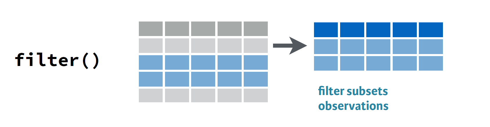
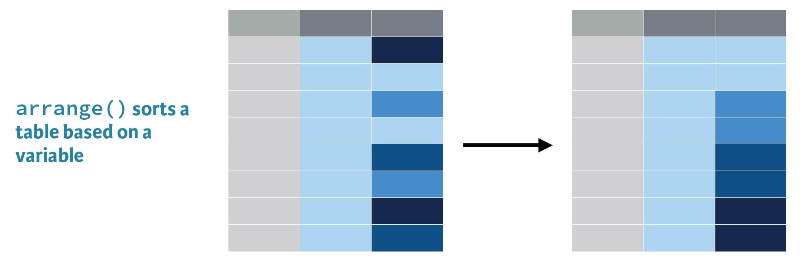
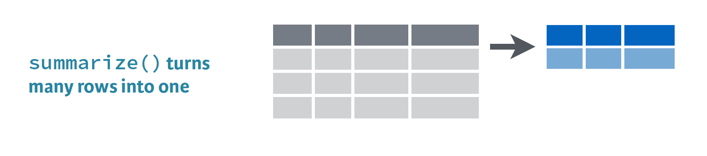
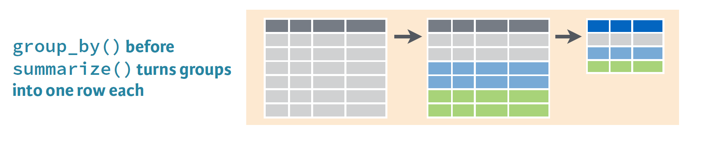
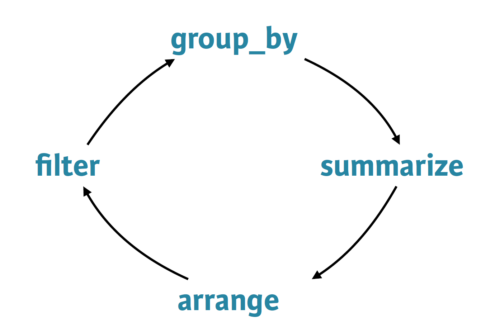
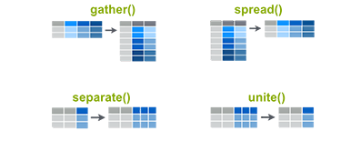
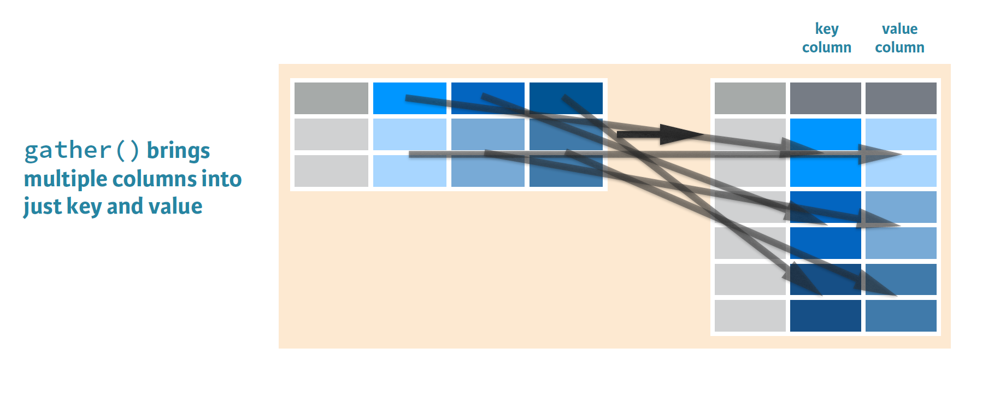

```{r setup, include = FALSE}
knitr::opts_chunk$set(echo = TRUE)
```

# Introduction
Welcome to your first SDS session. In this session, you will learn the basic grammar of data manipulation, some best-practice advices

In our OWSEMN pipeline, we will here focus mainly in

* **O:** Obtaining our data
* **S:** Scrubbing / Cleaning our data

Particular focus will be on **S**, while we keep the **O** parts simple. More tricky data-gathering settings will be encountered in later sessions. Since data manipulation always follows a purpose and requires some understanding of the data at hand, we will also have a first glance in **E** (exploration and visualization). However, we will her only cover the very basics and skip most of the details. Again, you will have a dedicated sessions lateron.

In this session, you will learn:

* How to do basic variable filtering, selection, and manipulation
* How to create various types of data summarization
* How to also apply these actions on grouped data
* How to join data from different sources
* How to reshape your data
* How to deal with missing values

From my experience, this covers ca. 95% of common data manipulation tasks. Sound like fun? Lets get started!

# Before we start: Some digression on data manipulation workflopws with [`dplyr`](https://dplyr.tidyverse.org/)
Base R comes with quite some functionality for slicing and dicing data, there also exists a myriad specialized packages for more tricky data manipulation. To read others' code and example as well as to perform some special operations, you all should be able to use standard R syntax. Lets create a super-simple dataframe and slice it a bit. Lets imagine we have 10 persons with a corresponging numeric id, and some value, such as an IQ score. Soem are members of group A, and some of group B or C. We generate that all somnewhat random:

```{r}
x <- data.frame(id = 1:10, 
                group = sample(LETTERS[1:3], 10, replace = TRUE),
                score = rnorm(10, mean = 0, sd = 1) )
x
```

Now, lets imaging we would like to sort, subset or aggregate it, we would do stuff like:

```{r}
# ordering by score
x[order(x$score),]
```
or
```{r}
# selecting only positive scores
x[x$score >= 0,]
```
or
```{r}
# replacing negative scores with zero
x[x$score < 0, "score"] <- 0
```

while that is all possible, the `[row, column]` syntax is not very comfortable. Further, for more tricky operation such as certain aggregations etc., one has to rely on a variety of packages, which often come with an own syntax.

The good news is: The efforts of a small set of key-developers (foremost [Hadley Wickham](http://hadley.nz/)) has let to the development of the  [`tidyverse`](https://www.tidyverse.org/), an ecosystem of R packages particularly designed for data science applications. All packages share an underlying design philosophy, common API, grammar, and data structures. 

Among the most amazing contributions here is [`dplyr`](https://dplyr.tidyverse.org/), a grammar of data manipulation, providing a consistent set of verbs that help you solve the most common data manipulation challenges. I use `dplyr` for 90% of my data-manipulation tasks for the following reasons:

* All the underlying code is runs optimized in `C++`, making it faster than most base R
* It consistently unifies the grammar of data manipulation to a small set of operations, which can be flexibly combined to master almost every task
* It is designed to work neathly with the `%>%` pipe-operator of [magrittr](hhttps://magrittr.tidyverse.org/) (more on that later)
* its syntax is very similar to the logic of `SQL` and other data-management languages
* It expanded far beoyond its original 5 verbs, and now replaces most base R commands with optimized, clever, and high-performance altgernatives
* It works neathly with many databases, such as `SQL`

I will not touch on all packages there, but the complete `tidyverse` covers almost all issues of data manipulation. They all operate under the same logic, are fast, and usually your best choice for almost any given problem. Particularly `dplyr` is enourmeously powerfull, and has a lot more functions than the basics I cover here. So, for every given probloblem, your first question (to yourself or [stackoverflow](https://stackoverflow.com/)) should be:

1: Is there a way to solve my problem in `dplyr`?
2: If not, is there another `tidyverse` package dedicated to this problem?

## General syntax
So, let's zoom in the `dplyr` functionality and syntax for a moment, before we illustrate it at the following data-manipulation tasks.

dplyr is designed to abstract over how the data is stored. That means as well as working with local data frames, you can also work with remote database tables, using exactly the same R code. Install the `dbplyr` package then read `vignette("databases", package = "dbplyr")`.

First, let's install (if necessary) and load it. For the sake of illustration, I will load every package of the `tidyverse` one-by-one when we need it. However, normally I just load `library(tidyverse)` all at once, since I need a lot of these packages often anyhow

```{r, warning = FALSE}
# # The easiest way to get dplyr is to install the whole tidyverse, including GGplot2 and all the stuff we will need later anyhow:
# install.packages("tidyverse")
# library(tidyverse) # To load the whole compilation of packages
library(dplyr)
library(magrittr) # For some advanced piping operations not included in dplyr
```


### Piping in `dplyr`


in traditional R syntax, data-manipulations are carried out one by one. For example, one would first assign a new variable `x$numbers <- 1:5`, then maybe manipulate it `x$numbers <- x$numbers * 2`, and subset it `x <- x[x$numbers > 4]`. `dplyr` makes use of `margrittr`'s pipes, written like `%>%`. A pipe means take the output of it's left-hand side and insert it as first input in the function on the right-hand side. Accordingly, all `dplyr` functions follow the syntax that their first input is always the data to be manipulated. Therefore, they can all be "piped".

The example before we could pipe as follows:

```{r, eval = FALSE}
x <- data_frame(numbers = 1:5) %>%
  mutate(numbers = numbers * 2) %>%
  filter(numbers > 4)
```

It basically reads lite: Create a dataframe (to be precise, a `tibble`) with the variable "numbers" and assign the values 1:5 THEN multiply them with 2 THEN subset the dataframe to only rows with a nuimber value higher than 4.

It first looks not so intuitive, but it will become your second nature. Using pipes facilitates fast, reproducible and easily readable coding practices, and all of you are encouraged to go on with that.

One note: `%>%` pipes do not autometically assign their output to the left-hand side object, meaning the original dataset will not per se be overwritten. To do that, there are two ways:
1: Initially, assign the output to the original data with `<-`
2: Initially, use `margrittr`'s `%<>%` command, meaning: Assign and pipe.

```{r, eval = FALSE, warning = FALSE}
x <- x %>%
  filter(numbers > 5)

x %<>%
  filter(numbers > 8) 
```

In conclusion:
The pipe basically passes on dataframe between functions in the following way:

```{r, eval = FALSE, warning = FALSE}
x %>% fun(y)
# Is equivalent to
fun(x, y)

# While
x %<>% fun(y)
# Is equivalent to
x <- fun(x, y)
```


### The 5 core verbs of data-manipulation
At ity's core are 5 central verbs of data/manipulation, which are

1. `filter()` picks cases based on their values.
2. `select()` picks variables based on their names.
3. `arrange()` changes the ordering of the rows.
4. `mutate()` adds new variables that are functions of existing variables
5. `summarise()` reduces multiple values down to a single summary.

These all combine naturally with `group_by()` which allows you to perform any operation "by group". You can learn more about them in `vignette("dplyr")`. As well as these single-table verbs, dplyr also provides a variety of two-table verbs (joins and mutations), which you can learn about in `vignette("two-table")`.

We will explore now a bit with the starwars dataset, which comes together with `dplyr`

```{r}
head(starwars) # The "startwars" dataset is an integrated dplyr goddie :)
```

For a first inspection of new data, I like the corresponding function in the little `skimr` package, which gives a nice brief summary on data, types, and values.

```{r}
# install.packages("skimr")
library(skimr)
skim(starwars)
```


#### 1: `filter()`
The verb `filter()` lets you subset a dataframe by rows (observations), meaning the output will filter for only rows which fulfill a certain condition.



```{r}
starwars %>% 
  filter(species == "Droid")
```

Conditions can be logically combined with boolean operators (`&, |`)

```{r}
starwars %>% 
  filter(homeworld == "Tatooine" & species == "Droid")
```

#### 2: `select()`
The verb `select()` lets you subset a dataframe by column (variable), meaning the output will only contain certain columns in the stated order

```{r}
starwars %>% 
  select(name, homeworld)
```

It can also be used to deselect columns with a leading `-`

```{r}
starwars %>% 
  select(-birth_year, -skin_color) 
```

Lastly, many of `dplyr`'s other conditions can be applied to select or deselect columns. More on that later.

```{r}
starwars %>% 
  select(name, ends_with("color")) 
```

#### 3: `arrange()`
The verb `arrange()` defines the way the rows of your dataframe are ordered



```{r}
starwars %>% 
  arrange(homeworld, desc(mass))
```

#### 4: `mutate()`
The verb `mutate()` lets you manipulate existing variables or create new ones.


```{r}
starwars %>% 
  mutate(bmi = mass / ((height / 100)  ^ 2),
         mass.rel = mass / max(mass, na.rm = TRUE)) %>%
  select(name:mass, mass.rel, bmi) %>%
  arrange(desc(bmi))
```


#### 5: `summarize()`
The verb `summarize()` reduces your dataset to one observation, which is summarized according to a defined function.



```{r}
starwars %>% 
  summarize(min.height = min(height, na.rm = TRUE),
            mean.height = mean(height, na.rm = TRUE),
            max.height = max(height, na.rm = TRUE),            
            sd.height = sd(height, na.rm = TRUE) )
```


#### Doing manipulation by group: `group_by`
Finally, `by_group()` is offers the perfect complement to the 5 basic verbs, since it allows to perform aqll the above mentioned tasks sepperate according to used-defined groupings in one or multiple categories. Lets look at some examples:



First of all, it works amazingly well with the `summarize()` verb, producing within group summaries

```{r}
starwars %>% 
  group_by(homeworld) %>%
  summarize(mean.height = mean(height, na.rm = TRUE)) %>%
  ungroup() %>%
  arrange(desc(mean.height))
```

Note that it is adviced to finish always such operations with `ungroup()`. Otherwise, the still active grouping might at a later point lead to all kind of unforseen results.

#### Two-table verbs
It's rare that a data analysis involves only a single table of data. In practice, you'll normally have many tables that contribute to an analysis, and you need flexible tools to combine them. In `dplyr`, there are three families of verbs that work with two tables at a time:

1. Mutating joins, which add new variables to one table from matching rows in another.
2. Filtering joins, which filter observations from one table based on whether or not they match an observation in the other table.
3. Set operations, which combine the observations in the data sets as if they were set elements.

Among those, mutating joins are the by far most used ones, so we will briefly discuss them here, and cover other types later in the applied part. For questions right away, consult `vignette(two-"two-table")`. Mutating joins allow you to combine variables from multiple tables (merging data). We here assume our data is "tidy" (meaning: rows = observations, columns = variables). 

Lets briefly create some example data:
```{r}
df1 <- data_frame(x = c(1, 2), y = 2:1)
df2 <- data_frame(x = c(1, 3), a = 10, b = "a")
df1
df2
```

There are 4 types of mutating join to combine variables from dataframe `x` and `y, which differ in their behaviour when a match is not found. We'll illustrate each with a simple example:

1. `left_join(x, y)` includes all observations in `x`, regardless of whether they match or not. This is the most commonly used join because it ensures that you don't lose observations from your primary table.
```{r}
df1 %>% left_join(df2)
```


2. `right_join(x, y)` includes all observations in `y`. It's equivalent to `left_join(y, x)`, but the columns will be ordered differently.
```{r}
df1 %>% right_join(df2)
```

```{r}
df2 %>% left_join(df1)
```

3. `inner_join(x, y)` only includes observations that match in both `x` and `y`.
```{r}
df1 %>% inner_join(df2)
```

4. `full_join()` includes all observations from `x` and `y`.
```{r}
df1 %>% full_join(df2)
```

The left, right and full joins are collectively know as **outer joins**. When a row doesn't match in an outer join, the new variables are filled in with missing values. 

While mutating joins are primarily used to add new variables, they can also generate new observations. If a match is not unique, a join will add all possible combinations (the Cartesian product) of the matching observations:

```{r}
df1 <- data_frame(x = c(1, 1, 2), y = 1:3)
df2 <- data_frame(x = c(1, 1, 2), z = c("a", "b", "a"))

df1 %>% left_join(df2)
```

Note: In case of multiple matches in `y`, adittional rows will be added. Therefore, if that is not the behavior you want, use the `distinct()` function afterwards.

By default, joins are performed on the bases of **all** variables appearing in `x` and `y`. You can also specify one or multiple variables that should be matched by using the `by` argument. This can also be used to match on variables with different names in `x` and `y`.

```{r}
df1 <- data_frame(x = c(3, 2, 1), y = 1:3, z = c(1,3,4))
df2 <- data_frame(x = c(1, 2, 3), y = 2:4, q = c("a", "b", "a"))

df1 %>% left_join(df2, by = "x")
df1 %>% left_join(df2, by = c("x", "y"))
df1 %>% left_join(df2, by = c("x" = "y"))
```

###  FInal remarks
Even though that doesnt sound too much, when combining them right, these basic verbs will enable you to do ca 80% of common data manipulation tasks.



```{r, influde = FALSE}
rm(df1, df2, x)
```


# Case Study: Cleaning up historical data on voting of the United Nations General Assembly

So, after we refreshed the basic grammar of data-manipulation, we will put it to a test in the following example. We will step-by-step explore the power of the basic grammar of data-manipulation.

We will use the "UN GEneral Assembly Voting" dataset, and explore the pattern and some underlying mechanisms of country voting choices. Lets get started!


Source: Erik Voeten "Data and Analyses of Voting in the UN General Assembly" Routledge Handbook of International Organization, edited by Bob Reinalda (published May 27, 2013). Available at SSRN: http://ssrn.com/abstract=2111149


## Step 1: Optaining the deta
Usually, we would now have to download some data online, access it via an API or a local database, or something like that. The full dataset is available at [Harvard's DataVerse](https://dataverse.harvard.edu/dataset.xhtml?persistentId=hdl:1902.1/12379).  For a first warm up, we will skip this part, and use the following data I conveniently prepared for you.

A little hint here in case you want to load a `.csv` and stuff the like: The `data.table` package was a really nice function called `fread()` ( stands for "friendly read"), which by now replases mostly `R`'s standard `read.table`, `read.csv()` ect. since it is just faster, automatically recognizes most data format, and codes the variables smarter. However, back to our data. For my own workflow in R, I prefer to save datasets as `.rds` file, which creates a serialized version of the dataset and then saves it with gzip compression. Thatreduces the disk-space of datasets, while they are still read faster than for example a `.csv`.

```{r}
votes <- readRDS("data/votes.rds")
```


## Step 2: First Inspection

Lets first have a look what's in the dataset.

```{r}
votes  %>% head(10)
```

We see that the dataset is with 508,929 observations already somewhat large. We find a set of 4 variables. Doesn't sound so exiting on first glance. Anyhow, lets talk for a moment about the variables we have:

* **`rcid:`** The roll-call ID, serving as an unique identifyer for the resolution vouted on.
* **`session:`** The number of the session of the annual UNGA, starting with 1 for the historically first meeting
* **`vote:`** A numerical code representing the country's choice of vote:
     * 1 = Yes
     * 2 = Abstain
     * 3 = No
     * 8 = Not present
     * 9 = Not a member
* **`ccode:`** A numerical code to identify the country

So, to sum up: 
* Every row contains a voting choice for a particular resolution on country level. 
* Consequently, we will for every resulution have a single row for every country.
* All variables are coded numerically

## Step 3: Preprocessing

Whatever data you obtian, it usually needs a bit of manual "massage" to be ready for further analysis. Common steps here are

1. Check variable format (dates, strings, numeric etc.)
2. Check variable scaling (range, outliers)
3. Deal with missing values

While there are some more issues you could run into, we in the following go through a couple of common problems and see some easy ways how to solve them.

### Filtering
One step of data cleaning is removing observations (rows) that you're not interested in. In this case, you want to remove "Not present" and "Not a member". Since we are for now not interested in them, lets get rid of them

```{r}
votes %>% filter(vote <= 3)  %>% head(10)
```


### Adding a year column
The next step of data cleaning is manipulating your variables (columns) to make them more informative. In this case, you have a session column that is hard to interpret intuitively. But since the UN started voting in 1946, and holds one session per year, you can get the year of a UN resolution by adding 1945 to the session number.

```{r}
votes %>%
  mutate(year = session + 1945)  %>% head(10)
```

### Adding a country column
The country codes in the ccode column are what's called [Correlates of War codes](http://cow.dss.ucdavis.edu/data-sets/cow-country-codes), a numerical coding convention for country names. This isn't ideal for an analysis, since you'd like to work with recognizable country names.

For this and similar cases, the R package [`countrycode`](https://github.com/vincentarelbundock/countrycode) is really practical, since it allows for fast and easy ways to switch between many standard country-coding conventions.

```{r}
# # In case the package is not installed yet, do that first:
# install.packages("countrycode")
library(countrycode)

votes  %>%
  mutate(country = countrycode(ccode, "cown", "country.name"))  %>% head(10)
```

Here,we tell `countrycode` to transfer the Correlates of War Code ("cown") to the easily readable country name ("country.name"). Other transformations such as to ISO2 and ISO3 alphanumerical codes are also possible. Neath, isn't it?

Note that we up to now never changed the original `votes` data. All pipes upto now just created an output for illustration. To really change the data, we have to use the assign-and-pipe `%<>%`, or the manual assignment `<-`. So, lets finish this cleaning up and pipe the whole preprocessing all together. Since not all counrty codes matched a country name, we will also filter the unmatchedc out

```{r}
votes %<>% 
  filter(vote <= 3) %>%
  mutate(year = session + 1945,
         country = countrycode(ccode, "cown", "country.name")) %>%
  filter(!is.na(country))
votes %>% head(10)
```

## Generating first insights

###Summarizing the full dataset
In this analysis, we're going to focus on "% of votes that are yes" as a metric for the "agreeableness" of countries. we'll start by finding this summary for the entire dataset: the fraction of all votes in their history that were "yes". Note that within your call to `summarize()`, you can use `n()` to find the total number of votes and `mean(vote == 1)` (since the output of the logical operation is FALSE or TRUE, which is equivalent to 0 or 1) to find the fraction of "yes" votes.

```{r}
votes %>%
  summarize(total = n(),
            percent_yes = mean(vote == 1)) 
```

Ok, we see that in general, countries tend to be "aggreable". While nice to know, this is not terribly informative. As always, single numbers tell us little, trends, context, and comparison does usually provide more insights. So lets start with putting this number in perspective.

### Summarizing by year
The `summarize()` function is especially useful when used within groups. Here, it gives not a overal summary, but one for every group instance. For example, we might like to know how much the average "agreeableness" of countries changed from year to year. To examine this, you can use `group_by()` to perform your summary not for the entire dataset, but within each year.

```{r}
year <- votes %>%
  arrange(year) %>%
  group_by(year) %>%
  summarize(total = n(),
            percent_yes = mean(vote == 1)) 
year  %>% head(10)
```

On first galance, it looks like the overall "agreeableness" seems to increase over time. 

### Summarizing by country
In the last exercise, you performed a summary of the votes within each year. You could instead summarize() within each country, which would let you compare voting patterns between countries. For further analysis, we wil create a new dataframe on country level.

```{r}
country <- votes %>%
  group_by(country) %>%
  summarize(total = n(),
            percent_yes = mean(vote == 1))  
country  %>% head(10)
```

Let's inspect this country level voting pattern by looking at the most and least agreable countries by arranging the dataframe.

```{r}
country %>%
  arrange(desc(percent_yes))  %>% head(10)

country %>%
  arrange(percent_yes)  %>% head(10)
```

Here we have the top-10 agreable and non-agreable countries (note the use of `slice()`, one of the many advanced `dplyr` verbs). We see that Zanzibar is an absolutely non-agreeing country. Yet, we also see that they only participated in 2 votes. So, is that number reliable and informative? That is a classical example of how we might get misleading results when working with aggregated data without thorroughly investigating it upfront. 

So, in conclusion: We might want to get rid of countries with very litte total votes.

```{r}
country %<>%
  filter(total >= 100)
```

## First (petite) graphical exploration
Allright, lets go on with a little analysis of time trends. Here, we will do a bit more graphical exploration. Therefore, lets have a mini-introduction to graphical plotting. Since this will be 


### Digression: The Grammar of graphics, and [`ggplot2`](https://ggplot2.tidyverse.org/)
ggplot2 can be thought of as a mini-language (domain-specific language) within the R language. It is an R implementation of [Wilkinson's Grammar of Graphics book](https://www.springer.com/gp/book/9780387245447). [A Layered Grammar of Graphics](http://vita.had.co.nz/papers/layered-grammar.pdf) describes Hadley's implementation of these thoughts in the ggplot2's design. Conceptually, the main idea behind the Grammar of Graphics is that a statistical graphic is a mapping from variables to aesthetic attributes (x axis value, y axis value, color, shape, size) of geometric objects (points, line, bars). While the Grammar of Graphic contains more elements, we will focus in this brief intro in the two main ones, aestetics and geometries. 
* **Aestetics:** Devine the "surface" of your plot, in terms of what has to be mapped (size, coplor) on the x and y (and potentially adittional) axes. Aesteticts are defined within the `aes()` function.
* **Geometries:** Visual elements you can see in the plot itself, such as bars, lines, and points. They are defined within various `geom_XYZ()` functions.
Basically, you define a surface grid and then plot something on top. We will talk about all of that in depth in later sessions, for now that's all you need to know to understand the following simple examples.


### Plotting by year
So, lets graphically explore the development of agreeability over time. The code below is very simple. We pass our data `year` to the `ggplot()` function, which here only contains the basic aestetics `aes()`. In this case, we would like to map the `year` on the `x`, and the value of the `percent_yes` variable on the `y` axis. That defines the plot's surface. Then, we use the `+` to add a geometric element, in this case a line-plot.

```{r}
library(ggplot2)

year %>%
  ggplot(aes(x = year, y = percent_yes) ) +
  geom_line() 
```

Looks like the trend of increasing agreeability sort of peaked in the 80s.

### Summarizing by year and country
Ok, that was nice so far, even though not terribly interesting, since it's hard to interpret aggregated numbers of almost all the world's countries combined. More tangible insights we might get when zooming in a single country, or comparing trends over a set of countries. Therefore we need a bit of a different data structure. We now need one observation not for year or country, but for every country and year. Fortunatelly, that's easily done via multiple groupings.

```{r}
year_country <- votes %>%
  group_by(year, country) %>%
  summarize(total = n(),
            percent_yes = mean(vote == 1))
year_country  %>% head(10)
```

Ok, with this datastructure, we can do some interesting analysis. For example, we can only look at the development of Danish votes by filtering.


```{r}
year_country %>%
  filter(country == "Denmark") %>%
  ggplot(aes(x = year, y = percent_yes) ) +
  geom_line() 
```

#### Digression: The `%in%` operator
In case we want to compare a set of countries now, it would be convenient if we could select many of them in an easy way. Here, the `%in%` operator is handy. It basically just takes two vectors `x` and `y`, and for every element in `x` returns a Logical indication of this element is also contained in `y`. Example:

```{r}
c("the", "cake", "is", "a", "lie") %in% c("I", "would", "love", "to", "eat", "a", "cake")
```

We can following the same idea create a vector of country anmes we want to compare, and then filter our dataset for these countries.

```{r}
countries <- c("United States", "China", "France", "Denmark")

year_country %>%
  filter(country %in% countries)  %>% head(10)
```

So,l lets plot these countries. To have them all displayed in one plot, we could either create a `geom_line()` for every subset (would be silly), or define in ggplot's `aes()` that the categorical variable `country` should be mapped with different colors. Therefore, for every country, a sepperate line in a different color will be created.

```{r}
year_country %>%
  filter(country %in% countries) %>%
ggplot(aes(year, percent_yes, color = country)) +
  geom_line()
```

We indeed see differences between countries. While denmark seens to be somewhat stable around 50% agreement and disagreement (the Danish style...), the USA over time moved to a very low rate of agreement. China, which got its UN seat just in the 70s, appears to be the mosyt agreeable country in our small sample. 

We could obviously go on with all kind of similar graphical analysis, but I do not want to spoiler too much of what is about to come in later sessions. So, lets leave it with that.

## Joining our data with contextual information
Up to now, we just looked at general voting pattern, and then a bit more nuanced at pattern over time and across countries. What the specific votes whewre about, we up to now did not really care. However, every vote corresponds to an important geo- and sociopolitic issue. So, it's time to bring in a bit of context. Therefore, we will now also draw from an adittional dataset with more detailed information on the content of the corresponding vote, which we up to now treated as pure numbers. Lets take a look:


```{r}
descriptions <- readRDS("data/descriptions.rds")
descriptions %>% head(10) 
```

We find the following variables:

* `rcid`: The corresponding ID, which we already know from the previous dataset
* `session`: Likewise, the corresponging session number
* `date`: The day of the vote
* `unres`: The code of the corresponding UN resolution (Check it out in private, is very interesting)

Furthermore, there are 6 "dummy" (meaning 0 or 1 corresponding to FALSE or TRUE) regarding the broad topic of the resolution

* `me`: Palestinian conflict
* `nu`: Nuclear weapons and nuclear material
* `di`: Arms control and disarmament
* `hr`: Human rights
* `co`: Colonialism
* `ec`: Economic development

Little sidenote: We see that the `date` column here is formatted differntly, in the "YYYY-MM-DD" formaat. To transform it to a "YYYY" (year only) format, we could manipulate the string via **regular expressions** the `tidyverse` package [`stringr`](https://stringr.tidyverse.org) (which we will explore a bit later), or in base-R. However, working with differtent time format is always messy, and the `tidyverse` has a dedicated package for it, [`lubridate`](https://lubridate.tidyverse.org/). So we will use this opportunity for a simple date-transformation exercise:

```{r, warning = FALSE}
library(lubridate)
descriptions %<>%
  mutate(year = year(date)) 
descriptions %>% head(10)
```

Neath, isnt it? In similar way, you can easily switch between date formats.

We only have one row per resolution, not as in `votes` one per country vote. Since both dataframes share the `rcid`and `year` variable, we can join on these to augment our votes data with contextual information.


```{r}
votes_joined <- votes %>% select(-ccode) %>%
  inner_join(descriptions %>% select(-date, -session, -unres), by = c("rcid", "year"))
votes_joined %>% head(10)
```

Here, we perform an `inner_join()`, meaning that it will contain only rows that appear in both dataframes. We do so since we from now on want to look only at votes with contextual information (which are missing in some cases). Note that we deselect unused variables in `description` directly in the join.

Lets look what is voted in ceretain issues. Why not see how the USA over time voted on colonialism related issues.

```{r}
votes_joined %>%
  filter(country == "United States", co == 1) %>%
  group_by(year) %>%
  summarize(percent_yes = mean(vote == 1)) %>%
  ggplot(aes(year, percent_yes)) +
  geom_line()
```

We could also do the same exercise over all topics together in one plot. 

## Working with tidy data (pivoting, reshaping, or changing between long and wide data formats)
By now, we worked with the traditional data structure, where every column corresponds to one variable. We also call that a **wide*"** data format. This is in most cases the most efficient and prefered way to keep your data. However, there are some cases, where another dataformat would be more convenient.

For example, for range of graphical as well as numerical summaries, it would be nice to have every observation and every variable to be mapped in a single row. This format is also calles **long** (or in R slang, **tidy**) data. Adittionally, some real life datasets (including a lot of WorldBank, Eurostats, OECD, ect.) data is usually available in a long format. Therefore, weare in need of easily switching between long and wide formats, to **reshape** your data (in Excel slang, people call that **pivoting**).

Luckily, R's `tidyr` package offers you exactly these functionalities in 4 easy functions.



In detail, they are:
* `gather()`: collapse columns into rows (wide to long)
* `spread()`: spread two columns into multiple columns (long to wide)
* `unite()`: Unite multiple columns into one
* `separate()`: separate one column into multiple

### Tidying our data
For our task, we will now reshape our dataframe from wide to long (tidy), therefore use the `gather()` function. In order to represent the joined vote-topic data in a tidy form so we can analyze and graph by topic, we need to transform the data so that each row has one combination of country-vote-topic. This will change the data from having six columns (`me`, `nu`, `di`, `hr`, `co`, `ec`) to having two columns (`topic` and `has_topic`).



```{r}
library(tidyr)
votes_tidy <- votes_joined %>%
  gather(key = topic, value = has_topic, me:ec) %>%
  filter(has_topic == 1)
votes_tidy %>% head(10)
```

### Recoding the topics
There's one more step of data cleaning to make this more interpretable. To interpret the data more easily, recode the data to replace these codes with their full name. You can do that with `dplyr`'s `recode()` function, which replaces values with ones you specify.

```{r}
votes_tidy %<>%
  mutate(topic = recode(topic,
                        me = "Palestinian conflict",
                        nu = "Nuclear weapons and nuclear material",
                        di = "Arms control and disarmament",
                        hr = "Human rights",
                        co = "Colonialism",
                        ec = "Economic development"))
```

### Summarize by country, year, and topic
In previous exercises, you summarized the votes dataset by country, by year, and by country-year combination. Now that you have `topic` as an additional variable, you can summarize the votes for each combination of country, year, and topic (e.g. for the United States in 2013 on the topic of nuclear weapons.). This shows one of the advantages of working with tidy data: The ease to summarize lexible on categort+variable level.

```{r}
votes_tidy %>%
  group_by(country, year, topic) %>%
  summarize(total = n(), percent_yes = mean(vote == 1)) %>%
  ungroup() %>% head(10)
```

### Visualizing trends in topics for one country
Now we have a unique mapping of country, year, and topic, therefore can sily create summaries and summary graphs on all kind of level. For example, lets compare how the USA and Denmark over time voted on different topics. To create the plots for all topic at once, we will introduce a new `ggplot2` geometry, a `facet_wrap` over `topic`. This just creates a sepperate plot for every category within `topic`. Just take it here for the sake of illustration, the details will be covered in later sessions.

```{r}
votes_tidy %>%
  group_by(country, year, topic) %>%
  summarize(total = n(), percent_yes = mean(vote == 1)) %>%
  ungroup() %>%
  filter(country %in% c("United States", "Denmark")) %>%
  ggplot(aes(x = year, y = percent_yes, color = country)) +
  geom_line() +
  facet_wrap(~ topic)
```

Up to now, we always created line plots (`geom_line()`), but we could also do a scatterplot (`geom_point()`). To make time-trends more visible, we could add a smoothed trend-line (`geom_smooth(se = FALSE)`, don't bother with the details for now)


```{r}
votes_tidy %>%
  group_by(country, year, topic) %>%
  summarize(total = n(), percent_yes = mean(vote == 1)) %>%
  ungroup() %>%
  filter(country == "United States") %>%
  ggplot(aes(x = year, y = percent_yes)) +
  geom_point() +
  geom_smooth(se = FALSE) +
  facet_wrap(~ topic)
```

Ok, byt that's enough about visualization for now, I do not want to spoiler too much. Only thing I wanted to illustrate here is how easily multiple geometric layers can be added in ine plot. 

Another intersting thing we could do now is to find the most aggreable topic per country, emaning the one every country is most inclined to voe for "yes". As you will see, that is easily done in tidy data with combining the well known verbs. You're getting a hang on it, right?

```{r}
votes_tidy %>%
  group_by(country, topic) %>%
  summarize(total = n(), percent_yes = mean(vote == 1)) %>%
  ungroup() %>%
  arrange(country, desc(total)) %>%
  group_by(country) %>%
  slice(1) %>%
  ungroup() %>%
  filter(total > 50) %>%
  arrange(desc(percent_yes)) %>% head(10)
```

Similarly, we could look at the top-3 countries in favor of every topic.

```{r}
votes_tidy %>%
  group_by(country, topic) %>%
  summarize(total = n(), percent_yes = mean(vote == 1)) %>%
  ungroup() %>%
  filter(total > 50) %>%
  arrange(topic, desc(percent_yes), desc(total)) %>%
  group_by(topic) %>%
  slice(1:3) %>%
  select(topic, everything())
```

The combined use of `group_by()`, `arrange()`, and `slice()` is extremely neath to produce all kind of top-n summaries.

### Mini digression: Regular expressions

In cases when we need to manipulate or search character strings, knwoledge of regular [regular expressions](https://www.rstudio.com/wp-content/uploads/2016/09/RegExCheatsheet.pdf) is extremely useful. We not have time to venture further into that, but lets just assume:

1: We would like to identify rows where a certain string appears....

```{r}
votes_tidy %>%
  filter(grepl("Economic", topic)) %>% head(10)
```

2: or we want to replace a certain character string... eg. because it is just too long... The tidyverse library ``

```{r}
library(stringr)
votes_tidy %>%
  filter(grepl("Economic", topic)) %>% 
  mutate(topic = str_replace_all(topic, " development", " dev.")) %>% head(10)
```

Regular expressions are a bit of a mess to learn, but extremely powerful. In case you need it, give it a shot!

## Joining with macroeconomic data
Ok, so far so good. To complement this exhaustive exercise, we will add some adittional economic data from the WorldBank. Most large economkic data providers such as the Worldbank, UN, OECD, and Eurostat by now offer access to their data via an API, so we can conveniently access their database directly from our laptop at home. Nice, right? How to work with APIs will be, again, a topic of later sessions, so do not expect too many details here.

However, the large R community has made substantial effort to ease the access  to govermental data, resulting in many packes serving as wrappers for the corresponding APIs. That means, most of these databases can nowadays be accessed via high-level R commands, without having to bother with the programming language of the API. Moste noteworthy, the [R openGov](http://ropengov.github.io/) initiative. For this exercise, we will use the [`wbstats`](https://github.com/GIST-ORNL/wbstats) package, which lets you easily search, access, and download tfrom the WorldBank data catalogue.

Lets check it out!

```{r}
# install.packages("wbstats")
library(wbstats)
```

Sidenote: The packages at `cran` are the official releases. Some small packages, or the new version fo a known one, are not to be found there. However, we can also directly install them from `github`, using the `install_github()` function of the `devtools package`

## Download WB data
```{r, eval = FALSE}
install.packages("devtools")
devtools::install_github("GIST-ORNL/wbstats") # the :: lets you use a function of a package without pre-loading it.
```

The package is pretty cool, and lets us search the whole WB data native from our R

```{r}
str(wb_cachelist, max.level = 1)
```

We can also search indicators by text-pattern

```{r}
wbsearch(pattern = "military")
```

Interesting, lets get some military related variables out...

```{r}
military_data <- wb(indicator = c("MS.MIL.XPND.GD.ZS", "MS.MIL.XPRT.KD", "MS.MIL.TOTL.TF.ZS"), startdate = 1980, enddate = 2015)
head(military_data)
```

## Clean the data a bit
Tada! That was easy. However, we already see some issues with our data we need to solve before we can conveniently work with it.

1. The "Date" (meaning "year") variable is coded as a character string. We would like to have a numeric value (like in our viting data) instead
2. The basolute variable ``
3. The counrty names might not be written 100% as in our data. We might want to join via the normed "iso3" countrycode instead.
4. The data we get from the WB is "tidy" (long). In casde we want to join it with our data, we are in need of making it a wide dataset again.

Lets do that!

```{r}
military_cleaned <- military_data %>%
  rename(year = date) %>%
  mutate(year = as.numeric(year),
         country = countrycode(iso3c, "iso3c", "country.name") ) %>%
  filter(!is.na(country)) %>%
  select(country, year, indicatorID, value) %>%
  spread(key =  indicatorID, value = value) %>%
  mutate(MS.MIL.XPRT.KD = log(MS.MIL.XPRT.KD))

head(military_cleaned)
```

Lets see who spends most...

```{r}
military_cleaned %>%
  group_by(country) %>%
  summarize(mil.gdp = mean(MS.MIL.XPND.GD.ZS)) %>%
  arrange(desc(mil.gdp)) %>%
  head(10)
```

## Replace missing values
However, we have already seen that we have a lot of missing data for some of the indicators. We coudld eal with it here right now. However, the data is otherwise ready to be joined with our `votes` data. Let's in this case first join the data, then deal with missing variables.

```{r}
votes_joined2 <- votes_joined %>%
  filter(year >= 1980, year <= 2015) %>%
  left_join(military_cleaned, by = c("country", "year"))

# We also get rid of countries that are not present in our military data
votes_joined2 <- votes_joined2 %>%
  semi_join(military_cleaned, by = "country")
```

Ok, in the final dataset, the variables `MS.MIL.XPRT.KD` and `MS.MIL.TOTL.TF.ZS` still have just to many missing observations to deal with it (more or almost more missing than complete). so we drop them. 

```{r}
votes_joined2 %<>%
  select(-MS.MIL.XPRT.KD, -MS.MIL.TOTL.TF.ZS)

```


However, for `MS.MIL.XPND.GD.ZS` we have a kint-of ok coverage. So in case wen want to go on analyzing military spending, lets figure out what to do. We here have a couple of strategies....

1. We could just ignore them. 
2. We could also delete them
3. We could replace them by their mean
4. We could use advanced imputation techniques, eg. from the `mice`, `VIM`, `missForest`, `Amelia`, or `Hmisc` package (worth checking out)
5. We could try to exploit the time-series characteristics of our data for an imputation strategy.

Number 1-3 are trivial, and I guess you will manage on your own (hint, `dplyr`'s `replace_na()` function is convenient). Number 4 often makes sense and is worth investigating further, but for the sake of brevity,we will stick to number 5. here, often a good choice when working with time-series.

Here, we will use the `na.locf()` function from the `zoo` (a package specialized on working with time series data). "locf" stands for "last-observation-carried-forward", and what this function does is replacing a missing value by its previous value, if existing. Therefore, the data obviously has to be arranged in the right way (country, year). Furthermore, we before group by countries, that this behaviour only happens within a country, and values do not "spill-over" to the next country.

```{r}
# install.packages("zoo")
library(zoo)
votes_joined2 %<>%
  arrange(country, year) %>%
  group_by(country) %>% mutate_all(funs(na.locf(., na.rm = F))) %>% ungroup()
```

So, that's as good as it gets for now. Lets see whats in the new data. The first obvious question would be: Does military expenditure somewhat correlate with a countries voting behavior at the UN? 

## Your turn

Well, what about giving it a try on your own? A folder awaits you ready to download [---> HERE <---](https://github.com/SDS-AAU/M1-2018/tree/master/data), giving you the chance to explore a bit on your own. You could:

1. Start reconstructing the exercise done so far. Feel free to alter what you feel needs to be altered.
2. Do some own exploration of issues and relationships you find interesting.
3. Maybe add some other WB (or other source) data, to explore even further relationships

Have fun...


