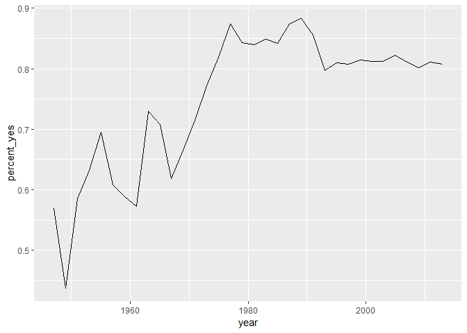
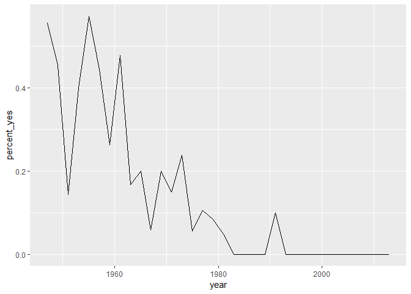
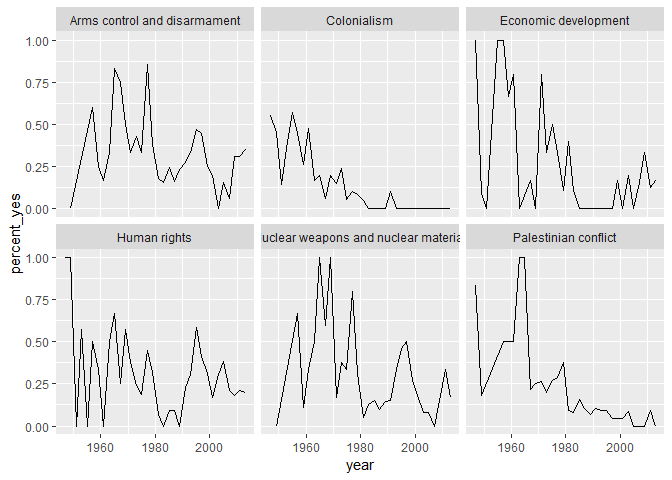

M1-2: Data Munging
================
Daniel S. Hain (<dsh@business.aau.dk>)

Introduction
============

blabla bla

`code`

Before we start: Some digression on data manipulation workflopws with [`dplyr`](https://dplyr.tidyverse.org/)
=============================================================================================================

Base R comes with quite some functionality for slicing and dicing data, there also exists a myriad specialized packages for more tricky data manipulation. To read others' code and example as well as to perform some special operations, you all should be able to use standard R syntax. Lets create a super-simple dataframe and slice it a bit. Lets imagine we have 10 persons with a corresponging numeric id, and some value, such as an IQ score. Soem are members of group A, and some of group B or C. We generate that all somnewhat random:

``` r
x <- data.frame(id = 1:10, 
                group = sample(LETTERS[1:3], 10, replace = TRUE),
                score = rnorm(10, mean = 0, sd = 1) )
x
```

    ##    id group       score
    ## 1   1     A  0.89757977
    ## 2   2     C -0.43508129
    ## 3   3     B  0.19020396
    ## 4   4     A  0.97967879
    ## 5   5     A -2.05315824
    ## 6   6     A -0.25699690
    ## 7   7     B  1.54838109
    ## 8   8     B  1.79553677
    ## 9   9     A  2.73763571
    ## 10 10     A  0.09400239

Now, lets imaging we would like to sort, subset or aggregate it, we would do stuff like:

``` r
# ordering by score
x[order(x$score),]
```

    ##    id group       score
    ## 5   5     A -2.05315824
    ## 2   2     C -0.43508129
    ## 6   6     A -0.25699690
    ## 10 10     A  0.09400239
    ## 3   3     B  0.19020396
    ## 1   1     A  0.89757977
    ## 4   4     A  0.97967879
    ## 7   7     B  1.54838109
    ## 8   8     B  1.79553677
    ## 9   9     A  2.73763571

or

``` r
# selecting only positive scores
x[x$score >= 0,]
```

    ##    id group      score
    ## 1   1     A 0.89757977
    ## 3   3     B 0.19020396
    ## 4   4     A 0.97967879
    ## 7   7     B 1.54838109
    ## 8   8     B 1.79553677
    ## 9   9     A 2.73763571
    ## 10 10     A 0.09400239

or

``` r
# replacing negative scores with zero
x[x$score < 0, "score"] <- 0
```

while that is all possible, the `[row, column]` syntax is not very comfortable. Further, for more tricky operation such as certain aggregations etc., one has to rely on a variety of packages, which often come with an own syntax.

The good news is: The efforts of a small set of key-developers (foremost [Hadley Wickham](http://hadley.nz/)) has let to the development of the [`tidyverse`](https://www.tidyverse.org/), an ecosystem of R packages particularly designed for data science applications. All packages share an underlying design philosophy, common API, grammar, and data structures.

Among the most amazing contributions here is [`dplyr`](https://dplyr.tidyverse.org/), a grammar of data manipulation, providing a consistent set of verbs that help you solve the most common data manipulation challenges. I use `dplyr` for 90% of my data-manipulation tasks for the following reasons: \* All the underlying code is runs optimized in `C++`, making it faster than most base R \* It consistently unifies the grammar of data manipulation to a small set of operations, which can be flexibly combined to master almost every task \* It is designed to work neathly with the `%>%` pipe-operator of [magrittr](hhttps://magrittr.tidyverse.org/) (more on that later) \* its syntax is very similar to the logic of `SQL` and other data-management languages \* It expanded far beoyond its original 5 verbs, and now replaces most base R commands with optimized, clever, and high-performance altgernatives \* It works neathly with many databases, such as `SQL`

General syntax
--------------

So, let's zoom in the `dplyr` functionality and syntax for a moment, before we illustrate it at the following data-manipulation tasks.

dplyr is designed to abstract over how the data is stored. That means as well as working with local data frames, you can also work with remote database tables, using exactly the same R code. Install the `dbplyr` package then read `vignette("databases", package = "dbplyr")`.

First, let's install (if necessary) and load it:

    ## Warning: package 'dplyr' was built under R version 3.5.1

    ## 
    ## Attaching package: 'dplyr'

    ## The following objects are masked from 'package:stats':
    ## 
    ##     filter, lag

    ## The following objects are masked from 'package:base':
    ## 
    ##     intersect, setdiff, setequal, union

### Piping in `dplyr`


in traditional R syntax, data-manipulations are carried out one by one. For example, one would first assign a new variable `x$numbers <- 1:5`, then maybe manipulate it `x$numbers <- x$numbers * 2`, and subset it `x <- x[x$numbers > 4]`. `dplyr` makes use of `margrittr`'s pipes, written like `%>%`. A pipe means take the output of it's left-hand side and insert it as first input in the function on the right-hand side. Accordingly, all `dplyr` functions follow the syntax that their first input is always the data to be manipulated. Therefore, they can all be "piped".

The example before we could pipe as follows:

``` r
x <- data_frame(numbers = 1:5) %>%
  mutate(numbers = numbers * 2) %>%
  filter(numbers > 4)
```

It basically reads lite: Create a dataframe (to be precise, a `tibble`) with the variable "numbers" and assign the values 1:5 THEN multiply them with 2 THEN subset the dataframe to only rows with a nuimber value higher than 4.

It first looks not so intuitive, but it will become your second nature. Using pipes facilitates fast, reproducible and easily readable coding practices, and all of you are encouraged to go on with that.

One note: `%>%` pipes do not autometically assign their output to the left-hand side object, meaning the original dataset will not per se be overwritten. To do that, there are two ways: 1: Initially, assign the output to the original data with `<-` 2: Initially, use `margrittr`'s `%<>%` command, meaning: Assign and pipe.

``` r
x <- x %>%
  filter(numbers > 5)

x %<>%
  filter(numbers > 8) 
```

### The 5 core verbs of data-manipulation

At ity's core are 5 central verbs of data/manipulation, which are

1.  `filter()` picks cases based on their values.
2.  `select()` picks variables based on their names.
3.  `arrange()` changes the ordering of the rows.
4.  `mutate()` adds new variables that are functions of existing variables
5.  `summarise()` reduces multiple values down to a single summary.

These all combine naturally with `group_by()` which allows you to perform any operation "by group". You can learn more about them in `vignette("dplyr")`. As well as these single-table verbs, dplyr also provides a variety of two-table verbs (joins and mutations), which you can learn about in `vignette("two-table")`.

We will explore now a bit with the starwars dataset, which comes together with `dplyr`

``` r
starwars
```

    ## # A tibble: 87 x 13
    ##    name     height  mass hair_color skin_color eye_color birth_year gender
    ##    <chr>     <int> <dbl> <chr>      <chr>      <chr>          <dbl> <chr> 
    ##  1 Luke Sk~    172    77 blond      fair       blue            19   male  
    ##  2 C-3PO       167    75 <NA>       gold       yellow         112   <NA>  
    ##  3 R2-D2        96    32 <NA>       white, bl~ red             33   <NA>  
    ##  4 Darth V~    202   136 none       white      yellow          41.9 male  
    ##  5 Leia Or~    150    49 brown      light      brown           19   female
    ##  6 Owen La~    178   120 brown, gr~ light      blue            52   male  
    ##  7 Beru Wh~    165    75 brown      light      blue            47   female
    ##  8 R5-D4        97    32 <NA>       white, red red             NA   <NA>  
    ##  9 Biggs D~    183    84 black      light      brown           24   male  
    ## 10 Obi-Wan~    182    77 auburn, w~ fair       blue-gray       57   male  
    ## # ... with 77 more rows, and 5 more variables: homeworld <chr>,
    ## #   species <chr>, films <list>, vehicles <list>, starships <list>

#### 1: `filter()`

The verb `filter()` lets you subset a dataframe by rows (observations), meaning the output will filter for only rows which fulfill a certain condition.


``` r
starwars %>% 
  filter(species == "Droid")
```

    ## # A tibble: 5 x 13
    ##   name  height  mass hair_color skin_color  eye_color birth_year gender
    ##   <chr>  <int> <dbl> <chr>      <chr>       <chr>          <dbl> <chr> 
    ## 1 C-3PO    167    75 <NA>       gold        yellow           112 <NA>  
    ## 2 R2-D2     96    32 <NA>       white, blue red               33 <NA>  
    ## 3 R5-D4     97    32 <NA>       white, red  red               NA <NA>  
    ## 4 IG-88    200   140 none       metal       red               15 none  
    ## 5 BB8       NA    NA none       none        black             NA none  
    ## # ... with 5 more variables: homeworld <chr>, species <chr>, films <list>,
    ## #   vehicles <list>, starships <list>

Conditions can be logically combined with boolean operators (`&, |`)

``` r
starwars %>% 
  filter(homeworld == "Tatooine" & species == "Droid")
```

    ## # A tibble: 2 x 13
    ##   name  height  mass hair_color skin_color eye_color birth_year gender
    ##   <chr>  <int> <dbl> <chr>      <chr>      <chr>          <dbl> <chr> 
    ## 1 C-3PO    167    75 <NA>       gold       yellow           112 <NA>  
    ## 2 R5-D4     97    32 <NA>       white, red red               NA <NA>  
    ## # ... with 5 more variables: homeworld <chr>, species <chr>, films <list>,
    ## #   vehicles <list>, starships <list>

#### 2: `select()`

The verb `select()` lets you subset a dataframe by column (variable), meaning the output will only contain certain columns in the stated order

``` r
starwars %>% 
  select(name, homeworld)
```

    ## # A tibble: 87 x 2
    ##    name               homeworld
    ##    <chr>              <chr>    
    ##  1 Luke Skywalker     Tatooine 
    ##  2 C-3PO              Tatooine 
    ##  3 R2-D2              Naboo    
    ##  4 Darth Vader        Tatooine 
    ##  5 Leia Organa        Alderaan 
    ##  6 Owen Lars          Tatooine 
    ##  7 Beru Whitesun lars Tatooine 
    ##  8 R5-D4              Tatooine 
    ##  9 Biggs Darklighter  Tatooine 
    ## 10 Obi-Wan Kenobi     Stewjon  
    ## # ... with 77 more rows

It can also be used to deselect columns with a leading `-`

``` r
starwars %>% 
  select(-birth_year, -skin_color)
```

    ## # A tibble: 87 x 11
    ##    name   height  mass hair_color eye_color gender homeworld species films
    ##    <chr>   <int> <dbl> <chr>      <chr>     <chr>  <chr>     <chr>   <lis>
    ##  1 Luke ~    172    77 blond      blue      male   Tatooine  Human   <chr~
    ##  2 C-3PO     167    75 <NA>       yellow    <NA>   Tatooine  Droid   <chr~
    ##  3 R2-D2      96    32 <NA>       red       <NA>   Naboo     Droid   <chr~
    ##  4 Darth~    202   136 none       yellow    male   Tatooine  Human   <chr~
    ##  5 Leia ~    150    49 brown      brown     female Alderaan  Human   <chr~
    ##  6 Owen ~    178   120 brown, gr~ blue      male   Tatooine  Human   <chr~
    ##  7 Beru ~    165    75 brown      blue      female Tatooine  Human   <chr~
    ##  8 R5-D4      97    32 <NA>       red       <NA>   Tatooine  Droid   <chr~
    ##  9 Biggs~    183    84 black      brown     male   Tatooine  Human   <chr~
    ## 10 Obi-W~    182    77 auburn, w~ blue-gray male   Stewjon   Human   <chr~
    ## # ... with 77 more rows, and 2 more variables: vehicles <list>,
    ## #   starships <list>

Lastly, many of `dplyr`'s other conditions can be applied to select or deselect columns. More on that later.

``` r
starwars %>% 
  select(name, ends_with("color"))
```

    ## # A tibble: 87 x 4
    ##    name               hair_color    skin_color  eye_color
    ##    <chr>              <chr>         <chr>       <chr>    
    ##  1 Luke Skywalker     blond         fair        blue     
    ##  2 C-3PO              <NA>          gold        yellow   
    ##  3 R2-D2              <NA>          white, blue red      
    ##  4 Darth Vader        none          white       yellow   
    ##  5 Leia Organa        brown         light       brown    
    ##  6 Owen Lars          brown, grey   light       blue     
    ##  7 Beru Whitesun lars brown         light       blue     
    ##  8 R5-D4              <NA>          white, red  red      
    ##  9 Biggs Darklighter  black         light       brown    
    ## 10 Obi-Wan Kenobi     auburn, white fair        blue-gray
    ## # ... with 77 more rows

#### 3: `arrange()`

The verb `arrange()` defines the way the rows of your dataframe are ordered


``` r
starwars %>% 
  arrange(homeworld, desc(mass))
```

    ## # A tibble: 87 x 13
    ##    name     height  mass hair_color skin_color eye_color birth_year gender
    ##    <chr>     <int> <dbl> <chr>      <chr>      <chr>          <dbl> <chr> 
    ##  1 Raymus ~    188    79 brown      light      brown             NA male  
    ##  2 Leia Or~    150    49 brown      light      brown             19 female
    ##  3 Bail Pr~    191    NA black      tan        brown             67 male  
    ##  4 Ratts T~     79    15 none       grey, blue unknown           NA male  
    ##  5 Lobot       175    79 none       light      blue              37 male  
    ##  6 Jek Ton~    180   110 brown      fair       blue              NA male  
    ##  7 Nute Gu~    191    90 none       mottled g~ red               NA male  
    ##  8 Ki-Adi-~    198    82 white      pale       yellow            92 male  
    ##  9 Mas Ame~    196    NA none       blue       blue              NA male  
    ## 10 Mon Mot~    150    NA auburn     fair       blue              48 female
    ## # ... with 77 more rows, and 5 more variables: homeworld <chr>,
    ## #   species <chr>, films <list>, vehicles <list>, starships <list>

#### 4: `mutate()`

The verb `mutate()` lets you manipulate existing variables or create new ones.


``` r
starwars %>% 
  mutate(bmi = mass / ((height / 100)  ^ 2),
         mass.rel = mass / max(mass, na.rm = TRUE)) %>%
  select(name:mass, mass.rel, bmi) %>%
  arrange(desc(bmi))
```

    ## # A tibble: 87 x 5
    ##    name                  height  mass mass.rel   bmi
    ##    <chr>                  <int> <dbl>    <dbl> <dbl>
    ##  1 Jabba Desilijic Tiure    175  1358   1      443. 
    ##  2 Dud Bolt                  94    45   0.0331  50.9
    ##  3 Yoda                      66    17   0.0125  39.0
    ##  4 Owen Lars                178   120   0.0884  37.9
    ##  5 IG-88                    200   140   0.103   35  
    ##  6 R2-D2                     96    32   0.0236  34.7
    ##  7 Grievous                 216   159   0.117   34.1
    ##  8 R5-D4                     97    32   0.0236  34.0
    ##  9 Jek Tono Porkins         180   110   0.0810  34.0
    ## 10 Darth Vader              202   136   0.100   33.3
    ## # ... with 77 more rows

#### 5: `summarize()`

The verb `summarize()` reduces your dataset to one observation, which is summarized according to a defined function.


``` r
starwars %>% 
  summarize(min.height = min(height, na.rm = TRUE),
            mean.height = mean(height, na.rm = TRUE),
            max.height = max(height, na.rm = TRUE),            
            sd.height = sd(height, na.rm = TRUE) )
```

    ## # A tibble: 1 x 4
    ##   min.height mean.height max.height sd.height
    ##        <dbl>       <dbl>      <dbl>     <dbl>
    ## 1         66        174.        264      34.8

#### Doing manipulation by group: `group_by`

Finally, `by_group()` is offers the perfect complement to the 5 basic verbs, since it allows to perform aqll the above mentioned tasks sepperate according to used-defined groupings in one or multiple categories. Lets look at some examples:


First of all, it works amazingly well with the `summarize()` verb, producing within group summaries

``` r
starwars %>% 
  group_by(homeworld) %>%
  summarize(mean.height = mean(height, na.rm = TRUE)) %>%
  ungroup() %>%
  arrange(desc(mean.height))
```

    ## # A tibble: 49 x 2
    ##    homeworld   mean.height
    ##    <chr>             <dbl>
    ##  1 Quermia            264 
    ##  2 Kashyyyk           231 
    ##  3 Kalee              216 
    ##  4 Kamino             208.
    ##  5 Utapau             206 
    ##  6 Cerea              198 
    ##  7 Ojom               198 
    ##  8 Champala           196 
    ##  9 Glee Anselm        196 
    ## 10 Serenno            193 
    ## # ... with 39 more rows

Note that it is adviced to finish always such operations with `ungroup()`. Otherwise, the still active grouping might at a later point lead to all kind of unforseen results.

#### Two-table verbs

It's rare that a data analysis involves only a single table of data. In practice, you'll normally have many tables that contribute to an analysis, and you need flexible tools to combine them. In `dplyr`, there are three families of verbs that work with two tables at a time:

1.  Mutating joins, which add new variables to one table from matching rows in another.
2.  Filtering joins, which filter observations from one table based on whether or not they match an observation in the other table.
3.  Set operations, which combine the observations in the data sets as if they were set elements.

Among those, mutating joins are the by far most used ones, so we will briefly discuss them here, and cover other types later in the applied part. For questions right away, consult `vignette(two-"two-table")`. Mutating joins allow you to combine variables from multiple tables (merging data). We here assume our data is "tidy" (meaning: rows = observations, columns = variables).

Lets briefly create some example data:

``` r
df1 <- data_frame(x = c(1, 2), y = 2:1)
df2 <- data_frame(x = c(1, 3), a = 10, b = "a")
df1
```

    ## # A tibble: 2 x 2
    ##       x     y
    ##   <dbl> <int>
    ## 1     1     2
    ## 2     2     1

``` r
df2
```

    ## # A tibble: 2 x 3
    ##       x     a b    
    ##   <dbl> <dbl> <chr>
    ## 1     1    10 a    
    ## 2     3    10 a

There are 4 types of mutating join to combine variables from dataframe `x` and \`y, which differ in their behaviour when a match is not found. We'll illustrate each with a simple example:

1.  `left_join(x, y)` includes all observations in `x`, regardless of whether they match or not. This is the most commonly used join because it ensures that you don't lose observations from your primary table.

``` r
df1 %>% left_join(df2)
```

    ## Joining, by = "x"

    ## # A tibble: 2 x 4
    ##       x     y     a b    
    ##   <dbl> <int> <dbl> <chr>
    ## 1     1     2    10 a    
    ## 2     2     1    NA <NA>

1.  `right_join(x, y)` includes all observations in `y`. It's equivalent to `left_join(y, x)`, but the columns will be ordered differently.

``` r
df1 %>% right_join(df2)
```

    ## Joining, by = "x"

    ## # A tibble: 2 x 4
    ##       x     y     a b    
    ##   <dbl> <int> <dbl> <chr>
    ## 1     1     2    10 a    
    ## 2     3    NA    10 a

``` r
df2 %>% left_join(df1)
```

    ## Joining, by = "x"

    ## # A tibble: 2 x 4
    ##       x     a b         y
    ##   <dbl> <dbl> <chr> <int>
    ## 1     1    10 a         2
    ## 2     3    10 a        NA

1.  `inner_join(x, y)` only includes observations that match in both `x` and `y`.

``` r
df1 %>% inner_join(df2)
```

    ## Joining, by = "x"

    ## # A tibble: 1 x 4
    ##       x     y     a b    
    ##   <dbl> <int> <dbl> <chr>
    ## 1     1     2    10 a

1.  `full_join()` includes all observations from `x` and `y`.

``` r
df1 %>% full_join(df2)
```

    ## Joining, by = "x"

    ## # A tibble: 3 x 4
    ##       x     y     a b    
    ##   <dbl> <int> <dbl> <chr>
    ## 1     1     2    10 a    
    ## 2     2     1    NA <NA> 
    ## 3     3    NA    10 a

The left, right and full joins are collectively know as **outer joins**. When a row doesn't match in an outer join, the new variables are filled in with missing values.

While mutating joins are primarily used to add new variables, they can also generate new observations. If a match is not unique, a join will add all possible combinations (the Cartesian product) of the matching observations:

``` r
df1 <- data_frame(x = c(1, 1, 2), y = 1:3)
df2 <- data_frame(x = c(1, 1, 2), z = c("a", "b", "a"))

df1 %>% left_join(df2)
```

    ## Joining, by = "x"

    ## # A tibble: 5 x 3
    ##       x     y z    
    ##   <dbl> <int> <chr>
    ## 1     1     1 a    
    ## 2     1     1 b    
    ## 3     1     2 a    
    ## 4     1     2 b    
    ## 5     2     3 a

Note: In case of multiple matches in `y`, adittional rows will be added. Therefore, if that is not the behavior you want, use the `distinct()` function afterwards.

By default, joins are performed on the bases of **all** variables appearing in `x` and `y`. You can also specify one or multiple variables that should be matched by using the `by` argument. This can also be used to match on variables with different names in `x` and `y`.

``` r
df1 <- data_frame(x = c(3, 2, 1), y = 1:3, z = c(1,3,4))
df2 <- data_frame(x = c(1, 2, 3), y = 2:4, q = c("a", "b", "a"))

df1 %>% left_join(df2, by = "x")
```

    ## # A tibble: 3 x 5
    ##       x   y.x     z   y.y q    
    ##   <dbl> <int> <dbl> <int> <chr>
    ## 1     3     1     1     4 a    
    ## 2     2     2     3     3 b    
    ## 3     1     3     4     2 a

``` r
df1 %>% left_join(df2, by = c("x", "y"))
```

    ## # A tibble: 3 x 4
    ##       x     y     z q    
    ##   <dbl> <int> <dbl> <chr>
    ## 1     3     1     1 <NA> 
    ## 2     2     2     3 <NA> 
    ## 3     1     3     4 <NA>

``` r
df1 %>% left_join(df2, by = c("x" = "y"))
```

    ## # A tibble: 3 x 5
    ##       x     y     z   x.y q    
    ##   <dbl> <int> <dbl> <dbl> <chr>
    ## 1     3     1     1     2 b    
    ## 2     2     2     3     1 a    
    ## 3     1     3     4    NA <NA>

### FInal remarks

xxxxx

Case Study: Cleaning up historical data on voting of the United Nations General Assembly
========================================================================================

So, after we refreshed the basic grammar of data-manipulation, we will put it to a test in the following example. We will step-by-step explore the power of the basic grammar of data-manipulation.

We will use the "UN GEneral Assembly Voting" dataset, and explore the pattern and some underlying mechanisms of country voting choices. Lets get started!


Source: Erik Voeten "Data and Analyses of Voting in the UN General Assembly" Routledge Handbook of International Organization, edited by Bob Reinalda (published May 27, 2013). Available at SSRN: <http://ssrn.com/abstract=2111149>

Step 1: Optaining the deta
--------------------------

Usually, we would now have to download some data online, access it via an API or a local database, or something like that. The full dataset is available at [Harvard's DataVerse](https://dataverse.harvard.edu/dataset.xhtml?persistentId=hdl:1902.1/12379). For a first warm up, we will skip this part, and use the following data I conveniently prepared for you:

``` r
votes <- readRDS("data/votes.rds")
```

Note: For my own workflow in R, I prefer to save datasets (if not too large) as `.rds` file, which creates a serialized version of the dataset and then saves it with gzip compression. Thatreduces the disk-space of datasets, while they are still read faster than for example a `.csv`.

Step 2: First Inspection
------------------------

Lets first have a look what's in the dataset.

``` r
votes
```

    ## # A tibble: 508,929 x 4
    ##     rcid session  vote ccode
    ##    <dbl>   <dbl> <dbl> <int>
    ##  1    46       2     1     2
    ##  2    46       2     1    20
    ##  3    46       2     9    31
    ##  4    46       2     1    40
    ##  5    46       2     1    41
    ##  6    46       2     1    42
    ##  7    46       2     9    51
    ##  8    46       2     9    52
    ##  9    46       2     9    53
    ## 10    46       2     9    54
    ## # ... with 508,919 more rows

We see that the dataset is with 508,929 observations already somewhat large. We find a set of 4 variables. Doesn't sound so exiting on first glance. Anyhow, lets talk for a moment about the variables we have:

-   **`rcid:`** The roll-call ID, serving as an unique identifyer for the resolution vouted on.
-   **`session:`** The number of the session of the annual UNGA, starting with 1 for the historically first meeting
-   **`vote:`** A numerical code representing the country's choice of vote:
    -   1 = Yes
    -   2 = Abstain
    -   3 = No
    -   8 = Not present
    -   9 = Not a member
-   **`ccode:`** A numerical code to identify the country

So, to sum up: \* Every row contains a voting choice for a particular resolution on country level. \* Consequently, we will for every resulution have a single row for every country. \* All variables are coded numerically

Step 3: Preprocessing
---------------------

### Filtering

One step of data cleaning is removing observations (rows) that you're not interested in. In this case, you want to remove "Not present" and "Not a member". Since we are for now not interested in them, lets get rid of them

``` r
votes %>% filter(vote <= 3)
```

    ## # A tibble: 353,547 x 4
    ##     rcid session  vote ccode
    ##    <dbl>   <dbl> <dbl> <int>
    ##  1    46       2     1     2
    ##  2    46       2     1    20
    ##  3    46       2     1    40
    ##  4    46       2     1    41
    ##  5    46       2     1    42
    ##  6    46       2     1    70
    ##  7    46       2     1    90
    ##  8    46       2     1    91
    ##  9    46       2     1    92
    ## 10    46       2     1    93
    ## # ... with 353,537 more rows

### Adding a year column

The next step of data cleaning is manipulating your variables (columns) to make them more informative. In this case, you have a session column that is hard to interpret intuitively. But since the UN started voting in 1946, and holds one session per year, you can get the year of a UN resolution by adding 1945 to the session number.

``` r
votes %>%
  mutate(year = session + 1945)
```

    ## # A tibble: 508,929 x 5
    ##     rcid session  vote ccode  year
    ##    <dbl>   <dbl> <dbl> <int> <dbl>
    ##  1    46       2     1     2  1947
    ##  2    46       2     1    20  1947
    ##  3    46       2     9    31  1947
    ##  4    46       2     1    40  1947
    ##  5    46       2     1    41  1947
    ##  6    46       2     1    42  1947
    ##  7    46       2     9    51  1947
    ##  8    46       2     9    52  1947
    ##  9    46       2     9    53  1947
    ## 10    46       2     9    54  1947
    ## # ... with 508,919 more rows

### Adding a country column

The country codes in the ccode column are what's called [Correlates of War codes](http://cow.dss.ucdavis.edu/data-sets/cow-country-codes), a numerical coding convention for country names. This isn't ideal for an analysis, since you'd like to work with recognizable country names.

For this and similar cases, the R package [`countrycode`](https://github.com/vincentarelbundock/countrycode) is really practical, since it allows for fast and easy ways to switch between many standard country-coding conventions.

``` r
# # In case the package is not installed yet, do that first:
# install.packages("countrycode")
library(countrycode)
```

    ## Warning: package 'countrycode' was built under R version 3.5.1

``` r
votes  %>%
  mutate(country = countrycode(ccode, "cown", "country.name"))
```

    ## Warning in countrycode(ccode, "cown", "country.name"): Some values were not matched unambiguously: 260, 816

    ## # A tibble: 508,929 x 5
    ##     rcid session  vote ccode country           
    ##    <dbl>   <dbl> <dbl> <int> <chr>             
    ##  1    46       2     1     2 United States     
    ##  2    46       2     1    20 Canada            
    ##  3    46       2     9    31 Bahamas           
    ##  4    46       2     1    40 Cuba              
    ##  5    46       2     1    41 Haiti             
    ##  6    46       2     1    42 Dominican Republic
    ##  7    46       2     9    51 Jamaica           
    ##  8    46       2     9    52 Trinidad & Tobago 
    ##  9    46       2     9    53 Barbados          
    ## 10    46       2     9    54 Dominica          
    ## # ... with 508,919 more rows

Here,we tell `countrycode` to transfer the Correlates of War Code ("cown") to the easily readable country name ("country.name"). Other transformations such as to ISO2 and ISO3 alphanumerical codes are also possible. Neath, isn't it?

Note that we up to now never changed the original `votes` data. All pipes upto now just created an output for illustration. To really change the data, we have to use the assign-and-pipe `%<>%`, or the manual assignment `<-`. So, lets finish this cleaning up and pipe the whole preprocessing all together.

``` r
votes %<>% 
  filter(vote <= 3) %>%
  mutate(year = session + 1945,
         country = countrycode(ccode, "cown", "country.name"))
```

    ## Warning in countrycode(ccode, "cown", "country.name"): Some values were not matched unambiguously: 260, 816

``` r
votes
```

    ## # A tibble: 353,547 x 6
    ##     rcid session  vote ccode  year country           
    ##    <dbl>   <dbl> <dbl> <int> <dbl> <chr>             
    ##  1    46       2     1     2  1947 United States     
    ##  2    46       2     1    20  1947 Canada            
    ##  3    46       2     1    40  1947 Cuba              
    ##  4    46       2     1    41  1947 Haiti             
    ##  5    46       2     1    42  1947 Dominican Republic
    ##  6    46       2     1    70  1947 Mexico            
    ##  7    46       2     1    90  1947 Guatemala         
    ##  8    46       2     1    91  1947 Honduras          
    ##  9    46       2     1    92  1947 El Salvador       
    ## 10    46       2     1    93  1947 Nicaragua         
    ## # ... with 353,537 more rows

Generating first insights
-------------------------

### Summarizing the full dataset

In this analysis, we're going to focus on "% of votes that are yes" as a metric for the "agreeableness" of countries. we'll start by finding this summary for the entire dataset: the fraction of all votes in their history that were "yes". Note that within your call to `summarize()`, you can use `n()` to find the total number of votes and `mean(vote == 1)` (since the output of the logical operation is FALSE or TRUE, which is equivalent to 0 or 1) to find the fraction of "yes" votes.

``` r
votes %>%
  summarize(total = n(),
            percent_yes = mean(vote == 1))
```

    ## # A tibble: 1 x 2
    ##    total percent_yes
    ##    <int>       <dbl>
    ## 1 353547       0.800

Ok, we see that in general, countries tend to be "aggreable". While nice to know, this is not terribly informative. As always, single numbers tell us little, trends, context, and comparison does usually provide more insights. So lets start with putting this number in perspective.

### Summarizing by year

The `summarize()` function is especially useful when used within groups. Here, it gives not a overal summary, but one for every group instance. For example, we might like to know how much the average "agreeableness" of countries changed from year to year. To examine this, you can use `group_by()` to perform your summary not for the entire dataset, but within each year.

``` r
year <- votes %>%
  arrange(year) %>%
  group_by(year) %>%
  summarize(total = n(),
            percent_yes = mean(vote == 1)) 
year
```

    ## # A tibble: 34 x 3
    ##     year total percent_yes
    ##    <dbl> <int>       <dbl>
    ##  1  1947  2039       0.569
    ##  2  1949  3469       0.438
    ##  3  1951  1434       0.585
    ##  4  1953  1537       0.632
    ##  5  1955  2169       0.695
    ##  6  1957  2708       0.609
    ##  7  1959  4326       0.588
    ##  8  1961  7482       0.573
    ##  9  1963  3308       0.729
    ## 10  1965  4382       0.708
    ## # ... with 24 more rows

On first galance, it looks like the overall "agreeableness" seems to increase over time.

### Summarizing by country

In the last exercise, you performed a summary of the votes within each year. You could instead summarize() within each country, which would let you compare voting patterns between countries. For further analysis, we wil create a new dataframe on country level.

``` r
country <- votes %>%
  group_by(country) %>%
  summarize(total = n(),
            percent_yes = mean(vote == 1))
```

Let's inspect this country level voting pattern by looking at the most and least agreable countries by arranging the dataframe.

``` r
country %>%
  arrange(desc(percent_yes)) %>%
  slice(1:10)
```

    ## # A tibble: 10 x 3
    ##    country              total percent_yes
    ##    <chr>                <int>       <dbl>
    ##  1 São Tomé & Príncipe   1091       0.976
    ##  2 Seychelles             881       0.975
    ##  3 Djibouti              1598       0.961
    ##  4 Guinea-Bissau         1538       0.960
    ##  5 Timor-Leste            326       0.957
    ##  6 Mauritius             1831       0.950
    ##  7 Zimbabwe              1361       0.949
    ##  8 Comoros               1133       0.947
    ##  9 United Arab Emirates  1934       0.947
    ## 10 Mozambique            1701       0.947

``` r
country %>%
  arrange(percent_yes) %>%
  slice(1:10)
```

    ## # A tibble: 10 x 3
    ##    country                          total percent_yes
    ##    <chr>                            <int>       <dbl>
    ##  1 Zanzibar                             2       0    
    ##  2 United States                     2568       0.269
    ##  3 Palau                              369       0.339
    ##  4 Israel                            2380       0.341
    ##  5 United Kingdom                    2558       0.417
    ##  6 France                            2527       0.427
    ##  7 Micronesia (Federated States of)   724       0.442
    ##  8 Marshall Islands                   757       0.491
    ##  9 Belgium                           2568       0.492
    ## 10 Canada                            2576       0.508

Here we have the top-10 agreable and non-agreable countries (note the use of `slice()`, one of the many advanced `dplyr` verbs). We see that Zanzibar is an absolutely non-agreeing country. Yet, we also see that they only participated in 2 votes. So, is that number reliable and informative? That is a classical example of how we might get misleading results when working with aggregated data without thorroughly investigating it upfront.

So, in conclusion: We might want to get rid of countries with very litte total votes.

``` r
country %<>%
  filter(total >= 100)
```

First (petite) graphical exploration
------------------------------------

Allright, lets go on with a little analysis of time trends. Here, we will do a bit more graphical exploration. Therefore, lets have a mini-introduction to graphical plotting. Since this will be

### Digression: The Grammar of graphics, and [`ggplot2`](https://ggplot2.tidyverse.org/)

ggplot2 can be thought of as a mini-language (domain-specific language) within the R language. It is an R implementation of [Wilkinson's Grammar of Graphics book](https://www.springer.com/gp/book/9780387245447). [A Layered Grammar of Graphics](http://vita.had.co.nz/papers/layered-grammar.pdf) describes Hadley's implementation of these thoughts in the ggplot2's design. Conceptually, the main idea behind the Grammar of Graphics is that a statistical graphic is a mapping from variables to aesthetic attributes (x axis value, y axis value, color, shape, size) of geometric objects (points, line, bars). While the Grammar of Graphic contains more elements, we will focus in this brief intro in the two main ones, aestetics and geometries. \* **Aestetics:** Devine the "surface" of your plot, in terms of what has to be mapped (size, coplor) on the x and y (and potentially adittional) axes. Aesteticts are defined within the `aes()` function. \* **Geometries:** Visual elements you can see in the plot itself, such as bars, lines, and points. They are defined within various `geom_XYZ()` functions. Basically, you define a surface grid and then plot something on top. We will talk about all of that in depth in later sessions, for now that's all you need to know to understand the following simple examples.

``` r
library(ggplot2)
```

    ## Warning: package 'ggplot2' was built under R version 3.5.1

### Plotting by year

So, lets graphically explore the development of agreeability over time. The code below is very simple. We pass our data `year` to the `ggplot()` function, which here only contains the basic aestetics `aes()`. In this case, we would like to map the `year` on the `x`, and the value of the `percent_yes` variable on the `y` axis. That defines the plot's surface. Then, we use the `+` to add a geometric element, in this case a line-plot.

``` r
year %>%
  ggplot(aes(x = year, y = percent_yes) ) +
  geom_line() 
```



Looks like the trend of increasing agreeability sort of peaked in the 80s.

### Summarizing by year and country

Ok, that was nice so far, even though not terribly interesting, since it's hard to interpret aggregated numbers of almost all the world's countries combined. More tangible insights we might get when zooming in a single country, or comparing trends over a set of countries. Therefore we need a bit of a different data structure. We now need one observation not for year or country, but for every country and year. Fortunatelly, that's easily done via multiple groupings.

``` r
year_country <- votes %>%
  group_by(year, country) %>%
  summarize(total = n(),
            percent_yes = mean(vote == 1))
year_country
```

    ## # A tibble: 4,737 x 4
    ## # Groups:   year [?]
    ##     year country     total percent_yes
    ##    <dbl> <chr>       <int>       <dbl>
    ##  1  1947 Afghanistan    34       0.382
    ##  2  1947 Argentina      38       0.579
    ##  3  1947 Australia      38       0.553
    ##  4  1947 Belarus        38       0.5  
    ##  5  1947 Belgium        38       0.605
    ##  6  1947 Bolivia        37       0.595
    ##  7  1947 Brazil         38       0.658
    ##  8  1947 Canada         38       0.605
    ##  9  1947 Chile          38       0.658
    ## 10  1947 Colombia       35       0.543
    ## # ... with 4,727 more rows

Ok, with this datastructure, we can do some interesting analysis. For example, we can only look at the development of Danish votes by filtering.

``` r
year_country %>%
  filter(country == "Denmark") %>%
  ggplot(aes(x = year, y = percent_yes) ) +
  geom_line() 
```


#### Digression: The `%in%` operator

In case we want to compare a set of countries now, it would be convenient if we could select many of them in an easy way. Here, the `%in%` operator is handy. It basically just takes two vectors `x` and `y`, and for every element in `x` returns a Logical indication of this element is also contained in `y`. Example:

``` r
c("the", "cake", "is", "a", "lie") %in% c("I", "would", "love", "to", "eat", "a", "cake")
```

    ## [1] FALSE  TRUE FALSE  TRUE FALSE

We can following the same idea create a vector of country anmes we want to compare, and then filter our dataset for these countries.

``` r
countries <- c("United States", "China", "France", "Denmark")

year_country %>%
  filter(country %in% countries)
```

    ## # A tibble: 124 x 4
    ## # Groups:   year [34]
    ##     year country       total percent_yes
    ##    <dbl> <chr>         <int>       <dbl>
    ##  1  1947 Denmark          38       0.632
    ##  2  1947 France           38       0.737
    ##  3  1947 United States    38       0.711
    ##  4  1949 Denmark          63       0.302
    ##  5  1949 France           64       0.312
    ##  6  1949 United States    64       0.281
    ##  7  1951 Denmark          25       0.4  
    ##  8  1951 France           25       0.36 
    ##  9  1951 United States    25       0.4  
    ## 10  1953 Denmark          26       0.654
    ## # ... with 114 more rows

So,l lets plot these countries. To have them all displayed in one plot, we could either create a `geom_line()` for every subset (would be silly), or define in ggplot's `aes()` that the categorical variable `country` should be mapped with different colors. Therefore, for every country, a sepperate line in a different color will be created.

``` r
year_country %>%
  filter(country %in% countries) %>%
ggplot(aes(year, percent_yes, color = country)) +
  geom_line()
```


We indeed see differences between countries. While denmark seens to be somewhat stable around 50% agreement and disagreement (the Danish style...), the USA over time moved to a very low rate of agreement. China, which got its UN seat just in the 70s, appears to be the mosyt agreeable country in our small sample.

We could obviously go on with all kind of similar graphical analysis, but I do not want to spoiler too much of what is about to come in later sessions. So, lets leave it with that.

Joining our data with contextual information
--------------------------------------------

Up to now, we just looked at general voting pattern, and then a bit more nuanced at pattern over time and across countries. What the specific votes whewre about, we up to now did not really care. However, every vote corresponds to an important geo- and sociopolitic issue. So, it's time to bring in a bit of context. Therefore, we will now also draw from an adittional dataset with more detailed information on the content of the corresponding vote, which we up to now treated as pure numbers. Lets take a look:

``` r
descriptions <- readRDS("data/descriptions.rds")
descriptions
```

    ## # A tibble: 2,589 x 10
    ##     rcid session date                unres      me    nu    di    hr    co
    ##    <dbl>   <dbl> <dttm>              <chr>   <dbl> <dbl> <dbl> <dbl> <dbl>
    ##  1    46       2 1947-09-04 00:00:00 R/2/299     0     0     0     0     0
    ##  2    47       2 1947-10-05 00:00:00 R/2/355     0     0     0     1     0
    ##  3    48       2 1947-10-06 00:00:00 R/2/461     0     0     0     0     0
    ##  4    49       2 1947-10-06 00:00:00 R/2/463     0     0     0     0     0
    ##  5    50       2 1947-10-06 00:00:00 R/2/465     0     0     0     0     0
    ##  6    51       2 1947-10-02 00:00:00 R/2/561     0     0     0     0     1
    ##  7    52       2 1947-11-06 00:00:00 R/2/650     0     0     0     0     1
    ##  8    53       2 1947-11-06 00:00:00 R/2/651     0     0     0     0     1
    ##  9    54       2 1947-11-06 00:00:00 R/2/651     0     0     0     0     1
    ## 10    55       2 1947-11-06 00:00:00 R/2/667     0     0     0     0     1
    ## # ... with 2,579 more rows, and 1 more variable: ec <dbl>

We find the following variables: \* `rcid`: The corresponding ID, which we already know from the previous dataset \* `session`: Likewise, the corresponging session number \* `date`: The day of the vote \* `unres`: The code of the corresponding UN resolution (Check it out in private, is very interesting) Furthermore, there are 6 "dummy" (meaning 0 or 1 corresponding to FALSE or TRUE) regarding the broad topic of the resolution \* `me`: Palestinian conflict \* `nu`: Nuclear weapons and nuclear material \* `di`: Arms control and disarmament \* `hr`: Human rights \* `co`: Colonialism \* `ec`: Economic development

Here, we only have one row per resolution, not as in `votes` one per country vote. Since both dataframes share the `rcid`and `session` variable, we can join on these to augment our votes data with contextual information.

``` r
votes_joined <- votes %>% select(-ccode) %>%
  inner_join(descriptions %>% select(-date, -unres), by = c("rcid", "session"))
```

    ## Warning: Column `rcid` has different attributes on LHS and RHS of join

    ## Warning: Column `session` has different attributes on LHS and RHS of join

``` r
votes_joined
```

    ## # A tibble: 353,547 x 11
    ##     rcid session  vote  year country      me    nu    di    hr    co    ec
    ##    <dbl>   <dbl> <dbl> <dbl> <chr>     <dbl> <dbl> <dbl> <dbl> <dbl> <dbl>
    ##  1    46       2     1  1947 United S~     0     0     0     0     0     0
    ##  2    46       2     1  1947 Canada        0     0     0     0     0     0
    ##  3    46       2     1  1947 Cuba          0     0     0     0     0     0
    ##  4    46       2     1  1947 Haiti         0     0     0     0     0     0
    ##  5    46       2     1  1947 Dominica~     0     0     0     0     0     0
    ##  6    46       2     1  1947 Mexico        0     0     0     0     0     0
    ##  7    46       2     1  1947 Guatemala     0     0     0     0     0     0
    ##  8    46       2     1  1947 Honduras      0     0     0     0     0     0
    ##  9    46       2     1  1947 El Salva~     0     0     0     0     0     0
    ## 10    46       2     1  1947 Nicaragua     0     0     0     0     0     0
    ## # ... with 353,537 more rows

Here, we perform an `inner_join()`, meaning that it will contain only rows that appear in both dataframes. We do so since we from now on want to look only at votes with contextual information (which are missing in some cases). Note that we deselect unused variables in `description` directly in the join.

Lets look what is voted in ceretain issues. Why not see how the USA over time voted on colonialism related issues.

``` r
votes_joined %>%
  filter(country == "United States", co == 1) %>%
  group_by(year) %>%
  summarize(percent_yes = mean(vote == 1)) %>%
  ggplot(aes(year, percent_yes)) +
  geom_line()
```



We could also do the same exercise over all topics together in one plot.

Working with tidy data (pivoting, reshaping, or changing between long and wide data formats)
--------------------------------------------------------------------------------------------

By now, we worked with the traditional data structure, where every column corresponds to one variable. We also call that a \*\*wide\*"\*\* data format. This is in most cases the most efficient and prefered way to keep your data. However, there are some cases, where another dataformat would be more convenient.

For example, for range of graphical as well as numerical summaries, it would be nice to have every observation and every variable to be mapped in a single row. This format is also calles **long** (or in R slang, **tidy**) data. Adittionally, some real life datasets (including a lot of WorldBank, Eurostats, OECD, ect.) data is usually available in a long format. Therefore, weare in need of easily switching between long and wide formats, to **reshape** your data (in Excel slang, people call that **pivoting**).

Luckily, R's `tidyr` package offers you exactly these functionalities in 4 easy functions.


In detail, they are: \* `gather()`: collapse columns into rows (wide to long) \* `spread()`: spread two columns into multiple columns (long to wide) \* `unite()`: Unite multiple columns into one \* `separate()`: separate one column into multiple

### Tidying our data

For our task, we will now reshape our dataframe from wide to long (tidy), therefore use the `gather()` function. In order to represent the joined vote-topic data in a tidy form so we can analyze and graph by topic, we need to transform the data so that each row has one combination of country-vote-topic. This will change the data from having six columns (`me`, `nu`, `di`, `hr`, `co`, `ec`) to having two columns (`topic` and `has_topic`).

``` r
library(tidyr)
```

    ## 
    ## Attaching package: 'tidyr'

    ## The following object is masked from 'package:magrittr':
    ## 
    ##     extract

``` r
votes_tidy <- votes_joined %>%
  gather(topic, has_topic, me:ec) %>%
  filter(has_topic == 1)
votes_tidy
```

    ## # A tibble: 350,032 x 7
    ##     rcid session  vote  year country            topic has_topic
    ##    <dbl>   <dbl> <dbl> <dbl> <chr>              <chr>     <dbl>
    ##  1    77       2     1  1947 United States      me            1
    ##  2    77       2     1  1947 Canada             me            1
    ##  3    77       2     3  1947 Cuba               me            1
    ##  4    77       2     1  1947 Haiti              me            1
    ##  5    77       2     1  1947 Dominican Republic me            1
    ##  6    77       2     2  1947 Mexico             me            1
    ##  7    77       2     1  1947 Guatemala          me            1
    ##  8    77       2     2  1947 Honduras           me            1
    ##  9    77       2     2  1947 El Salvador        me            1
    ## 10    77       2     1  1947 Nicaragua          me            1
    ## # ... with 350,022 more rows

### Recoding the topics

There's one more step of data cleaning to make this more interpretable. To interpret the data more easily, recode the data to replace these codes with their full name. You can do that with `dplyr`'s `recode()` function, which replaces values with ones you specify.

``` r
votes_tidy %<>%
  mutate(topic = recode(topic,
                        me = "Palestinian conflict",
                        nu = "Nuclear weapons and nuclear material",
                        di = "Arms control and disarmament",
                        hr = "Human rights",
                        co = "Colonialism",
                        ec = "Economic development"))
```

### Summarize by country, year, and topic

In previous exercises, you summarized the votes dataset by country, by year, and by country-year combination. Now that you have `topic` as an additional variable, you can summarize the votes for each combination of country, year, and topic (e.g. for the United States in 2013 on the topic of nuclear weapons.). This shows one of the advantages of working with tidy data: The ease to summarize lexible on categort+variable level.

``` r
votes_tidy %>%
  group_by(country, year, topic) %>%
  summarize(total = n(), percent_yes = mean(vote == 1)) %>%
  ungroup()
```

    ## # A tibble: 26,926 x 5
    ##    country      year topic                               total percent_yes
    ##    <chr>       <dbl> <chr>                               <int>       <dbl>
    ##  1 Afghanistan  1947 Colonialism                             8       0.5  
    ##  2 Afghanistan  1947 Economic development                    1       0    
    ##  3 Afghanistan  1947 Human rights                            1       0    
    ##  4 Afghanistan  1947 Palestinian conflict                    6       0    
    ##  5 Afghanistan  1949 Arms control and disarmament            3       0    
    ##  6 Afghanistan  1949 Colonialism                            22       0.864
    ##  7 Afghanistan  1949 Economic development                    1       1    
    ##  8 Afghanistan  1949 Human rights                            3       0    
    ##  9 Afghanistan  1949 Nuclear weapons and nuclear materi~     3       0    
    ## 10 Afghanistan  1949 Palestinian conflict                   11       0.818
    ## # ... with 26,916 more rows

### Visualizing trends in topics for one country

You can now visualize the trends in percentage "yes" over time for all six topics side-by-side. Here, you'll visualize them just for the United States.

``` r
votes_tidy %>%
  group_by(country, year, topic) %>%
  summarize(total = n(), percent_yes = mean(vote == 1)) %>%
  ungroup() %>%
  filter(country == "United States") %>%
  ggplot(aes(year, percent_yes)) +
  geom_line() +
  facet_wrap(~ topic)
```


