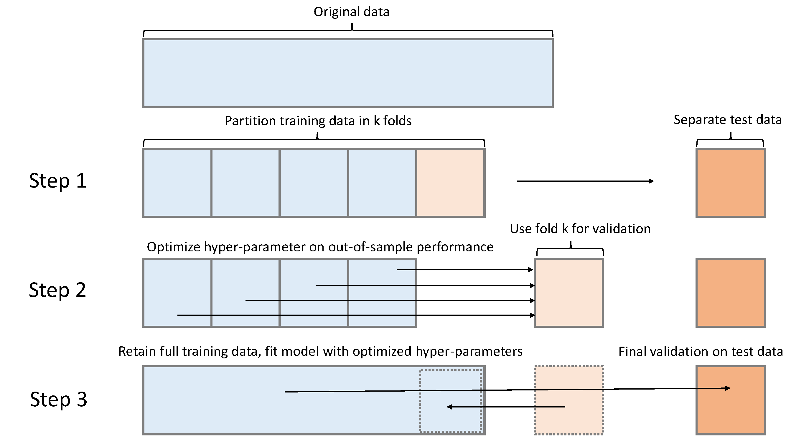
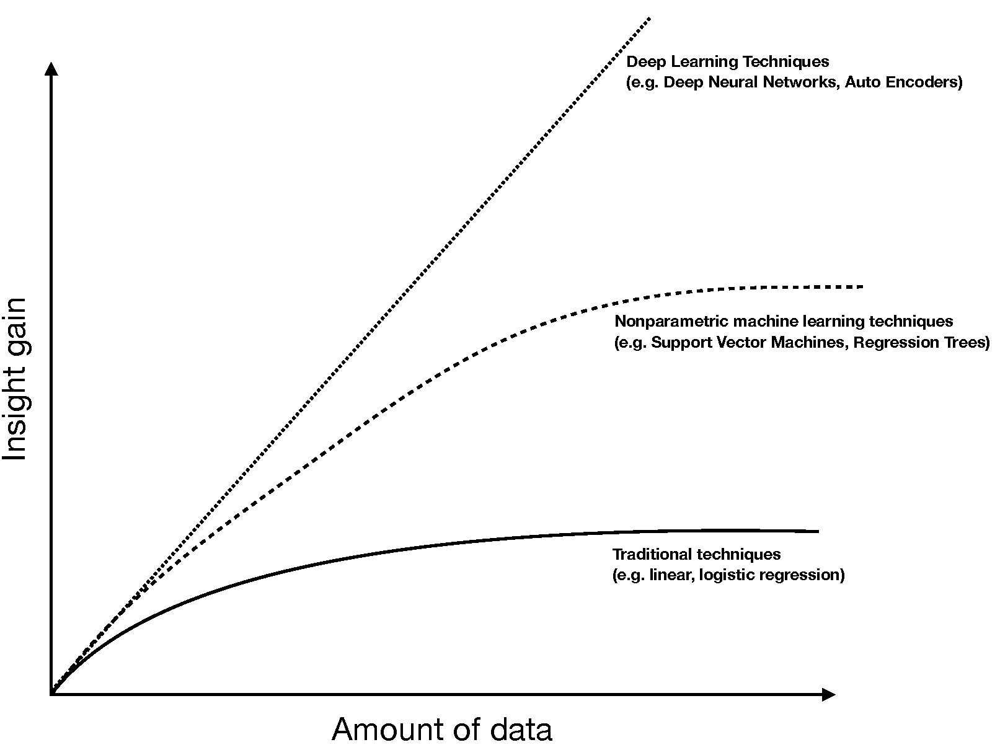
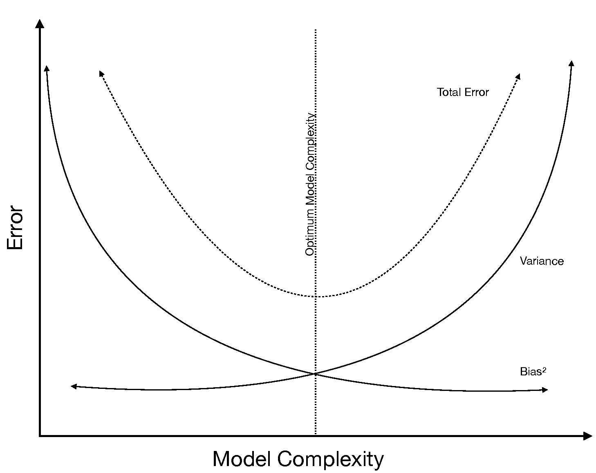
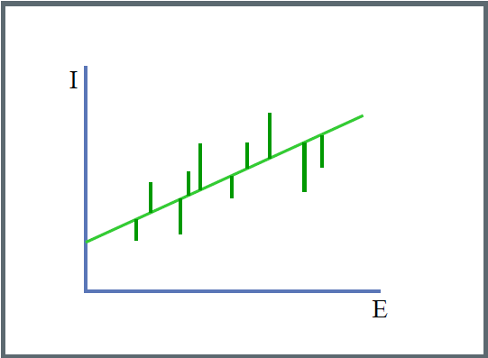

```{r setup, include=FALSE}
### Generic preamble
Sys.setenv(LANG = "en")

### Clean Workspace (I like to start clean)
rm(list=ls()); graphics.off() # get rid of everything in the workspace
detachAllPackages <- function() { # Also, detach packages to avoid functions masked by others
  basic.packages <- c("package:stats","package:graphics","package:grDevices","package:utils","package:datasets","package:methods","package:base")
  package.list <- search()[ifelse(unlist(gregexpr("package:",search()))==1,TRUE,FALSE)]
  package.list <- setdiff(package.list,basic.packages)
  if (length(package.list)>0)  for (package in package.list) detach(package, character.only=TRUE)
}
detachAllPackages(); rm(detachAllPackages)

### Load packages  Standard
library(knitr) # For display of the markdown
library(tidyverse) # Collection of all the good stuff like dplyr, ggplot2 ect.
library(magrittr)
library(data.table) # Good format to work with large datasets
library(skimr) # Nice descriptives


### pimp up memory (to save on disk if necessary, only works on windows)
#memory.limit(10 * 10^10)

### Knitr options
knitr::opts_chunk$set(echo = TRUE, warning = FALSE)
```


Some housekeeping (again)

```{r}
list.of.packages <- c("devtools", 
                      "rstudioapi", 
                      "tidyverse",
                      "knitr", 
                      "data.table",
                      "caret",
                      "ggridges",
                      "mlbench")
new.packages <- list.of.packages[!(list.of.packages %in% installed.packages()[,"Package"])]
if(length(new.packages)) install.packages(new.packages)
rm(list.of.packages)
```


# Introduction

## Contrasting ML^AI with inferential statistics

### Inferential Statistics
* Mostly interested in producing good **parameter estimates**: Construct models with unbiased estimates of $\beta$, capturing the relationship  $x$ and $y$.
* Supposedly \enquote{structural} models: Causal effect of directionality $x \rightarrow y$, robust across a variety of observed as well as up to now unobserved settings.
* How: Carefully draw from  theories and empirical findings, apply logical reasoning to formulate hypotheses.
* Typically, multivariate testing, cetris paribus.
* Main concern: Minimize standard errors $\epsilon$ of $\beta$ estimates.
* Not overly concerned with overall predictive power (eg. $R^2$) of those models, but about various type of endogeneity issues, leading us to develop sophisticated **identification strategies**


### ML\&AI Approach
* To large extend driven by the needs of the private sector $\rightarrow$ data analysis is gear towards producing good **predictions** of outcomes $\rightarrow$ fits for $\hat{y}$, not $\hat{\beta}$
     * Recommender systems: Amazon, Netflix, Sportify ect.
     * Risk scores}: Eg.g likelihood that a particular person has an accident, turns sick, or defaults on their credit.
     * Image classification: Finding Cats \& Dogs online
* Often rely on big data (N,$x_i$)
* Not overly concerned with the properties of parameter estimates, but very rigorous in optimizing the overall prediction accuracy.
* Often more flexibility wrt. the functional form, and non-parametric approaches.
* No "build in"" causality guarantee $\rightarrow$ verification techniques.
* Often sporadically used in econometric procedures, but seen as "son of a lesser god". 

## Issues with ML

### Generalization via "Out-of-Sample-Testing"

With so much freedom wrt. feature selection, functional form ect., models are prone to over-fitting. And no constraints by asymptotic properties, causality and so forth, how can we generalize anything?

In ML, generalization is not achived by statistical derivatives and theoretical argumentation, but rather by answering the practical question: **How well would my model perform with new data?** To answer this question, **Out-of-Sample-Testing** is usually taken as solution. Here, you do the following

1. Split the dataset in a training and a test sample.
2. Fit you regression (train your model) on one dataset
     * Optimal: Tune hyperparameters by minimizing loss in a validation set. 
     * Optimal: Retrain final model configuration on whole training set
3. Finally, evaluate predictive power on test sample, on which model is not fitted.
			
An advanced version is a "N-fold-Crossvalidation", where this process is repeated several time during the **hyperparameter-tuning** phase (more on that later).

{width=500px}

### Model complexity & Hyperparameter Tuning

As a rule-of-thumb: Richer and more complex functional forms and algorithms tend to be better in predictign complex real world pattern. This is particularly true for high-dimensional (big) data.

{width=500px}

However, flexible algorithms at one point become so good in mimicing the pattern in our data that they **overfit**, meaning are to much tuned towards a specific dataset and might not reproduce the same accuracy in new data. Therefore, we aim at finding the **sweet spot** of high model complexity yet high-performing out-of-sample predictions

{width=500px}

That we do usually in a process of **hyperparameter-tuning**, where we gear different options the models offer towards high out-of-sample predictive performance. MAthematically speaking, we try to optimize the following problem:

$$minimize \underbrace{\sum_{i=1}^{n}L(f(x_i),y_i),}_{in-sample~loss} ~ over \overbrace{~ f \in F ~}^{function~class} subject~to \underbrace{~ R(f) \leq c.}_{complexity~restriction}$$


# Regression

## Introduction (a brief reminder)

Lets for a second recap linear regression techniques, foremost the common allrounder and workhorse of statistical research since some 100 years.

**OLS = Ordinary Least Squares**

**Basic Properties**

* Outcome: contionous, 
* Predictors: continous, dichotonomous, categorical
* When to use: Predicting a phenomenon that scales and can be measured continuously


**Functional form**

$$y = \beta_0 + \beta_1 x_1 + \beta_2 x_2 + ... + \beta_n x_n + \epsilon $$

 where: 
 
* $y$ = Outcome, $x_i$ = observed value $ID_i$ 
* $\beta_0$ = Constant 
* $\beta_i$ = Estimated effect of $x_i$  on $y$ , slope of the linear function 
* $\epsilon$ = Error term 

And that is what happens. Lets imagine we plot some feature against an outcome we want to predict. OLS will just fit a straight line through your data.

{width=500px}

We do so by minimizing the sum of (squared) errors between our prediction-line and the observed outcome.

{width=500px}

### Executing a regression

So, lets get your hand dirty. We will load a standard dataset from `mlbench`, the BostonHousing dataset. It comes as a dataframe with 506 observations on 14 features, the last one `medv` being the outcome:

* `crim`	per capita crime rate by town
* `zn`	proportion of residential land zoned for lots over 25,000 sq.ft
* `indus`	proportion of non-retail business acres per town
* `chas`	Charles River dummy variable (= 1 if tract bounds river; 0 otherwise)
* `nox`	nitric oxides concentration (parts per 110 million)
* `rm`	average number of rooms per dwelling
* `age`	proportion of owner-occupied units built prior to 1940
* `dis`	weighted distances to five Boston employment centres
* `rad`	index of accessibility to radial highways
* `tax`	full-value property-tax rate per USD 10,000
* `ptratio`	pupil-teacher ratio by town
* `b`	1000(B - 0.63)^2 where B is the proportion of blacks by town
* `lstat`	lower status of the population
* `medv`	median value of owner-occupied homes in USD 1000's

Source: Harrison, D. and Rubinfeld, D.L. "Hedonic prices and the demand for clean air", J. Environ. Economics & Management, vol.5, 81-102, 1978.

These data have been taken from the UCI Repository Of Machine Learning Databases at ftp://ftp.ics.uci.edu/pub/machine-learning-databases

```{r}
library(mlbench)
data(BostonHousing) 
data <- BostonHousing %>% as_data_frame()
rm(BostonHousing)

data %<>%
  select(medv, everything()) %>%
  mutate(chas = as.numeric(chas))
```

Lets inspect the data for a moment.

```{r}
head(data)
glimpse(data)
skim(data)
```


Ok, us straight run our first linear model with the `lm()` function:

```{r}
lm.fit <- lm(medv ~ ., data = data)
summary(lm.fit)  
```

So, how would you interpret the results? Estimate? P-Value? $R^2$?

However, since this is a predictive exercise, we are foremost interested in how well the model predicts. So, lets use the `predict()` function.

```{r}
lm.pred <- predict(lm.fit) 
head(lm.pred, 10)
```

A common measure of predictive power of regresdsions models is the *Root-Mean-Squared-Error* (RSME), calculate as follows:

$$ RMSE = \sqrt{\frac{1}{n}\Sigma_{i=1}^{n}{\Big(\frac{d_i -f_i}{\sigma_i}\Big)^2}}$$

Lets calculate:

```{r}
error <-  pull(data, medv) -  lm.pred

# Calculate RMSE
sqrt(mean(error ^ 2))
```

We can also visualize the error term:

```{r}
# Some visualizatiom
error %>% as_data_frame() %>%
  ggplot(aes(value)) + 
  geom_histogram()
```


## ML workflows for regression analysis

### Define a subset for the hyperparameter tuning
However, how well does our OLS model predict out-of-sample? To do so, we have to set up an out-of-sample testing workflow. While that cound be done manually, we will use the (my very favorite) `caret` (=ClassificationAndREgressionTree) package, which has by now grown to be the most popular `R` package for ML, including a standardized ML workflow over more than 100 model classes.

First, we will now split our data in a train and test sample. We could create an index for subsetting manually. However, caret provides the nice `createDataPartition()` function, which does that for you. Nice feature is that it takes care that the outcomes (y) are proportionally distrubuted in the subset. That is particularly important in case the outcomes are very unbalanced.

```{r,echo=FALSE,warning=FALSE}
library(caret)
index <- createDataPartition(y = data$medv, p = 0.25, list = FALSE)

training <- data[index,] 
test <- data[-index,] 
```

### Preprocessing
Before tuning the models, there is still some final preprocessing to do. For typical preprocessing tasks for ML, I like to use the `reciepes` package. It lets you conveniently define a recipe of standard ML preprocessing tasks. Afterwards, we can just can use this recipe to "bake" our data, meaning performing all the steps in the recipe. Here, we do only some simple transformations. We normalizizing all numeric data by centering (subtracting the mean) and scaling (divide by standard deviation). Finally, we remove features with zero-variance (we dont have any here, but its a good practice to do that with unknown data).


```{r,echo=FALSE,warning=FALSE}

library(recipes)
reci <- recipe(medv ~ ., data = training) %>%
  step_center(all_numeric(), -all_outcomes()) %>% 
  step_scale(all_numeric(), -all_outcomes()) %>%
  step_zv(all_predictors()) %>%
  prep(data = train)
reci
```


Now we can "bake" our data, executing the recipe, and split in outcomes and features (is not necessary, but usually an easier workflow lateron).


```{r}
# Training: split in y and x
x_train <-bake(reci, newdata = training) %>% select(-medv) 
y_train <- training %>% pull(medv)

# test: split in y and x
x_test <-bake(reci, newdata = test) %>% select(-medv) 
y_test <- test %>% pull(medv)
```


```{r, include = FALSE}
rm(reci, training, test)
```


### Defining the training and control feature
We now get seriously started with the hyperparameter tuning. We will do so in the following way:

1. We split the data in a train (75%) and validation (25%) sample. The reason is to find for every model class the optimal hyperparameter configuration. We evaluate that according to its prediction performance in the validation sample.
2. We here do a n-fold crossvalidation, meaning that we again split the train sample again in n subsamples, on which we both fit and test every hyperparameter configuration. That minimizes the chance that the results are driven by a particular sampling. 

Sounds cumbersome. However, for this workflow caret allows us to automatize this workflow with defining a `trainControl()` object, which we pass to every model we fit lateron.

Here, we have to define a set of parameters. First, the number of crossvalidations. He here for the sake of time do just 2 (`method = "cv", number = 5`), but given enough computing power, RAM and/or time, for a real life calibration, I would recommend 5 or 10 folds. To be even more save, this whole process can be repeated serveral time (method = "repeatedcv", repeats = 5). Be aware, though, that time increases exponentially, which might make a difference when working with large data.

We sepperatly also define the metric to be optimized, here ROC AUC (area under the curve). Makes in this case more sense than accuracy, since we have unbalanced outcomes.


```{r}
ctrl <- trainControl(method = "cv", number = 5)
```


### Digression: Multicore usage and parallel computing
Since we here have quite some models to run, lets speed it up by utilizing parallel processing. Me here use the packages "parallel" and `doMC`, which together with caret implement parallel training super easy. So, lets exploit the cores we have on our server.

Note: doMC only properly works on Linux, for windows check out other alternatives. Here, use instead doMC the `doParallel` package and its `registerDoParallel()` function. Note: This one is a bit experimental, and does not always work reliable.

```{r}
# library(parallel)
# # Linux option
# library(parallel)
# library(doMC) # nice package that distributes among others caret train processes (if allowParallel = TRUE)
# registerDoMC(cores = round(detectCores() - 1) ) # On the server we have 16 cores, I want to leave one for my fellows.
# getDoParWorkers() # check how many "workers" are deployed

# # Windows option
# library(doParallel)
# cl <- parallel::makeCluster(detectCores() - 1)
# doParallel::registerDoParallel(cl)
# # Note : In doParallel, you need to stop your cluster when you are done with "parallel::stopCluster(cl)"
```


## Hyperparameter Tuning
So, we finally start fitting models. The logit we skip in this phase, since it has no tunable parameters.

### Linear Regression

```{r}
fit.lm <- train(x = x_train, y = y_train, 
                trControl = ctrl, 
                method = "lm")
summary(fit.lm)
fit.lm
```


### Elastic Net
The elastic net has the functional form of a generalized linear model, plus an adittional tgerm $\lambda$ a parameter which penalizes the coefficient by its contribution to the models loss in the form of:

$$\lambda \sum_{p=1}^{P} [ 1 - \alpha |\beta_p| + \alpha |\beta_p|^2]$$

Here, we have 2 tunable parameters, $\lambda$ and $\alpha$.  If $\alpha = 0$, we are left with $|\beta_i|$, turning it to a lately among econometricians very popular "Least Absolute Shrinkage and Selection Operator" (LASSO) regression. Obviously, when $\lambda = 0$, the whole term vanishes, and we are again left with a generalized linear model. The first thing we do now is to set up a tuneGrid, a matrix of value combinations of tunable hyperparameters we aim at optimizing. This is easily done with the base-R `expand.grid()` function.

```{r}
tune.glmnet = expand.grid(alpha = seq(0, 1, length = 5), 
                          lambda = seq(0, 1, length = 5))
tune.glmnet
```

Now, we utulize the caret `train` function to carry out the grid search as well as crossvalidation of our model. The train function is a wrapper that uses a huge variety (150+) of models from other packages, and carries out the model fitting workflow. Here, we pass the function our feature and outcome vectors (X, y), the parameters in the formerly defined trainControl object, the metric to be optimized, the model class (here "glmnet" from the corresponding package), and our formerly defined tuneGrid. Lets go!

```{r}
fit.glmnet <- train(x = x_train, y = y_train, trControl = ctrl, 
             method = "glmnet", family = "gaussian", tuneGrid = tune.glmnet)
fit.glmnet
```

We can also plot the results.

```{r}
plot(fit.glmnet)
```

```{r}
plot(varImp(fit.glmnet))
```


### Model evaluation
So, taking all together, lets see which model performs best out-of-sample:


```{r}
lm.pred <- predict(lm.fit, newdata = x_test) 
```


# ML for Classification

## Introduction

## Introduction tom the case

### Digression: Customer Churn: Hurts Sales, Hurts Company
Customer churn refers to the situation when a customer ends their relationship with a company, and it's a costly problem. Customers are the fuel that powers a business. Loss of customers impacts sales. Further, it's much more difficult and costly to gain new customers than it is to retain existing customers. As a result, organizations need to focus on reducing customer churn.

The good news is that machine learning can help. For many businesses that offer subscription based services, it's critical to both predict customer churn and explain what features relate to customer churn. 

### IBM Watson Dataset 
We now dive into the IBM Watson Telco Dataset. According to IBM, the business challenge is.

> A telecommunications company [Telco] is concerned about the number of customers leaving their landline business for cable competitors. They need to understand who is leaving. Imagine that you're an analyst at this company and you have to find out who is leaving and why.

The dataset includes information about:

* Customers who left within the last month: `Churn`
* Services that each customer has signed up for: phone, multiple lines, internet, online security, online backup, device protection, tech support, and streaming TV and movies
* Customer account information: how long they've been a customer, contract, payment method, paperless billing, monthly charges, and total charges
* Demographic info about customers: gender, age range, and if they have partners and dependents
Lets load it:
```{r}
rm(list=ls()); graphics.off() # get rid of everything in the workspace
data <- readRDS("data/telco_churn.rds")
```


## Data Inspection, exploration, preprocessing

Lets inspect our data

```{r}
head(data)
glimpse(data)
skim(data)
```


Lets do right away some preprocessing, and drop the customer ID, which we do not need. Let's also say we're lazy today, so we just prop observations with missing features (not good practice).

```{r}
data %<>%
  select(-customerID) %>%
  drop_na() %>%
  select(Churn, everything())
```


Next, lets have a first visual inspections. Many models in our prediction exercise to follow require the conditional distribution of the features to be different for the outcomes states to be predicted. So, lets take a look. Here, `ggplot2` plus the `ggridges` package is my favorite.


```{r}
require(ggridges)
data %>%
  gather(variable, value, -Churn) %>%
  ggplot(aes(y = as.factor(variable), 
             fill =  as.factor(Churn), 
             x = percent_rank(value)) ) +
  geom_density_ridges(alpha = 0.75)
```


Again, we split in a training and test dataset.

```{r}
library(caret)
index <- createDataPartition(y = data$Churn, p = 0.75, list = FALSE)

training <- data[index,] 
test <- data[-index,] 
```

We already see the numeric variable `TotalCharges` appears to be right skewed. That is not a problem for predictive modeling per se, yet some transformation might increase still its predictive power. Lets see. The easiest approximation is just to check the correlation.

```{r}
library(corrr)
training %>%
  select(Churn, TotalCharges) %>%
  mutate(
    Churn = Churn %>% as.factor() %>% as.numeric(),
    LogTotalCharges = log(TotalCharges)
  ) %>%
  correlate() %>%
  focus(Churn) %>%
  fashion()
```

Allright, seems as if it could be worth it. Now we can already write down or recipe.

```{r}
library(recipes)
reci <- recipe(Churn ~ ., data = training) %>%
  step_discretize(tenure, options = list(cuts = 6)) %>%
  step_log(TotalCharges) %>%
  step_dummy(all_nominal(), -all_outcomes()) %>%
  # step_string2factor(all_nominal()) %>%
  step_center(all_predictors(), -all_outcomes()) %>%
  step_scale(all_predictors(), -all_outcomes()) %>%
  prep(data = training)

reci
```

Now we just split again in predictors and outcomes, bake it all, and we are good to go.

```{r}
# Predictors
x_train <- bake(reci, newdata = training) %>% select(-Churn)
x_test  <- bake(reci, newdata = test) %>% select(-Churn)

# Response variables for training and testing sets
y_train <- pull(training, Churn) %>% as.factor()
y_test  <- pull(test, Churn) %>% as.factor()
```

We again define a `trainControl()` object. However, now we need some adittional parameters.

```{r}
ctrl <- trainControl(method = "repeatedcv", # repeatedcv, boot, cv, LOOCV, timeslice OR adaptive etc.
                     number = 10, 
                     repeats = 3,
                     classProbs = TRUE, 
                     summaryFunction = twoClassSummary,
                     returnData = FALSE,
                     returnResamp = "final",
                     savePredictions = "final",
                     # allowParallel = TRUE,
                     verboseIter = FALSE)

metric <- "ROC" 
```

### Standard logistic regression
Lets run the common allrounder first:

```{r}
fit.logit <- train(x = x_train, y = y_train, trControl = ctrl, metric = metric,
            method = "glm", family = "binomial") 
fit.logit
summary(fit.logit)
```

### Elastic net
We can surely also run an elasticnet with an logit-link (`family = "binomial`)

Now, we utulize the caret "train" function to carry out the grid search as well as crossvalidation of our model. The train function is a wrapper that uses a huge variety (150+) of models from other packages, and carries out the model fitting workflow. Here, we pass the function our feature and outcome vectors (X, y), the parameters in the formerly defined trainControl object, the metric to be optimized, the model class (here "glmnet" from the corresponding package), and our formerly defined tuneGrid. Lets go!

```{r}
tune.glmnet = expand.grid(alpha = seq(0, 1, length = 3), 
                          lambda = seq(0, 0.3, length = 7))

fit.glmnet <- train(x = x_train, y = y_train, trControl = ctrl, metric = metric, 
             method = "glmnet", family = "binomial", tuneGrid = tune.glmnet)
fit.glmnet
```

We can also plot the results.

```{r}
plot(fit.glmnet)
```

### Decision tree
Ok, next we will do the same exercise for a classification tree (we here use `rpart`, but there is a huge variety available). 

This one has only one tunable parameter. Here we are able to restrict the complexity via a hyperparameter cp. This parameter represents the complexity costs of every split, and allows further splits only if it leads to an decrease in model loss below this threshold.


```{r}
library(rpart)
tune.dt = expand.grid(cp = c(0.001, 0.005 ,0.010, 0.020, 0.040))

fit.dt <- train(x = x_train, y = y_train, trControl = ctrl, metric = metric,
             method = "rpart", tuneGrid =  tune.dt) 
fit.dt
plot(fit.dt)
```

We directly see that in this case, increasing complexity costs lead to decreasing model performance. Such results are somewhat typical for large datasets, where high complexity costs prevent the tree to fully exploit the richness of information. Therefore, we settle for a minimal cp of 0.001.

We can also plot the final plot structure.

```{r}
require(rpart.plot)
rpart.plot(fit.dt$finalModel)
```

This plot is usually informative, and gives us a nice intuition how the prediction works in classification trees. However, with that many dummies, it's a bit messy.


### Random Forest
Finally, we fit another class of models which has gained popularity in the last decade, and proven to be a powerful and versatile prediction technique which performs well in almost every setting, a random forest. As a continuation of tree-based classification methods, random forests aim at reducing overfitting by introducing randomness via bootstrapping, boosting, and ensemble techniques. The idea here is to create an "ensemble of classification trees"", all grown out of a different bootstrap sample. Having grown a forest of trees, every tree performs a prediction, and the final model prediction is formed by a majority vote of all trees.

In this case, we draw from a number of tunable hyperparameters. First, we tune the number of randomly selected features which are available candidates for every split on a range $[1,k-1]$, where lower values introduce a higher level of randomness to every split. Our second hyperparameter is the minimal number of observations which have to fall in every split, where lower numbers increase the potential precision of splits, but also the risk of overfitting. Finally, we also use the general splitrule as an hyperparameter, where the choice is between i.) a traditional split according to a the optimization of the gini coefficient of the distribution of classes in every split, and ii.) according to the "Extremely randomized trees"" (ExtraTree) procedure by Geurts (2016), where adittional randomness is introduced to the selection of splitpoints.

Note: We here use the "ranger" instead of the more popular "randomforest" package. For those who wonder: It basically does the same, only faster.


```{r}
library(ranger)
tune.rf <- expand.grid(mtry = round(seq(1, ncol(x_train)-1, length = 3)),
                       min.node.size = c(10, 50, 100),
                       splitrule = c("gini", "extratrees") )
                       
fit.rf <- train(x = x_train, y = y_train, trControl = ctrl,  metric = metric,
             method = "ranger", importance = "impurity", tuneGrid =  tune.rf, num.trees = 10) 
fit.rf
plot(fit.rf)
```

we see that number of randomly selected features per split of roughly half (22) of all available features in all cases maximizes model performance. Same goes for a high minimal number of observations (100) per split. Finally, the ExtraTree procedure first underperforms at a a minimal amount of randomly selected features, but outperforms the traditional gini-based splitrule when the number of available features increases. Such results are typical for large samples, where a high amount of injected randomness tends to make model predictions more robust.


## Final prediction

The adittional `caretEnsemble` package also has the `caretList()` function, where one can fit a set of different models jointly. In adittion, it takes care of the indexing for the resamples, so that they are the same for al models. Neath, isnt it? We could have done just and only that from the very beginning. We just did seperate models for illustration before. Note: Be prepared to wait some time.

```{r}
library(caretEnsemble)
models <- caretList(x = x_train, y = y_train, trControl = ctrl, metric = metric, continue_on_fail = T,
                   tuneList = list(logit = caretModelSpec(method = "glm", family = "binomial"),
                                   elasticnet = caretModelSpec(method = "glmnet", family = "binomial",
                                                               tuneGrid =  tune.glmnet),
                                   dt = caretModelSpec(method = "rpart",
                                                       tuneGrid =  tune.dt),
                                   rf = caretModelSpec(method = "ranger", importance = "impurity", num.trees = 25, 
                                                       tuneGrid =  tune.rf)   ) )
```


## Performance Evaluation
And done. Now, lets evaluate the results. This evaluation is now on the average prediction of the different folds on the validation fold in the train data (final evaluation will still come later). Lets take a look. We can also plot the model comparison.

```{r}
models
```

The last step is to recollect the results from each model and compare them. We here use the resamples function of caret. Lets check how the model perform.

```{r}
results <- resamples(models) 

results$values %>%
  select(-Resample) %>%
  tidy()

bwplot(results)
```


Lets see how similar the models predict.

```{r}
modelCor(results) 
```


## Evaluation via final out-of-sample prediction
Ok, to be as confident as possible, lets do the final evaluation. generally, many ML exercises can be done without it, and it is often common practice to go with the performance in the k-fold crossfalidation. However, I believe this final step should be done, if data permits. Only with this final prediction we expose our model to data it yet was not exposed to, neiter directly nor indirectly. 

we first let all models predict all models do their prediction on "test". We create 2 objects, one for the probability prediction (`type = "prob"`), and one for the predicted class of the outcome (where positive means $P \leq 0.5$). We do so, becuase we need both for different summaries to come.

```{r}
models.preds <- data.frame(lapply(models, predict, newdata = x_test)) 
models.preds.prob <- data.frame(lapply(models, predict, newdata = x_test, type = "prob"))
glimpse(models.preds)
glimpse(models.preds.prob)
```

Let's plot the corresponding confusion matrix for all models

```{r}
cm <- list()
cm$logit <- confusionMatrix(factor(factor(models.preds$logit)), y_test)
cm$elasticnet <- confusionMatrix(factor(models.preds$elasticnet), y_test)
cm$dt <- confusionMatrix(factor(models.preds$dt), y_test)
cm$rf <- confusionMatrix(factor(models.preds$rf), y_test)

par(mfrow=c(2,2))
for(i in 1:length(cm)) {fourfoldplot(cm[[i]]$table); title(main = names(cm[i]), cex.main = 1.5)}

```

And also the corresponding ROC curve...

```{r}
library(caTools)
ROC <- list()
ROC$logit <- colAUC(models.preds.prob$logit.Yes, y_test, plotROC = F)
ROC$elasticnet <- colAUC(models.preds.prob$elasticnet.Yes, y_test, plotROC = F)
ROC$dt <- colAUC(models.preds.prob$dt.Yes, y_test, plotROC = F)
ROC$rf <- colAUC(models.preds.prob$rf.Yes, y_test, plotROC = F)

par(mfrow=c(2,2))
for(i in 1:length(ROC)) {colAUC(models.preds.prob[[i*2]], y_test, plotROC = T); title(main = names(ROC[i]), cex.main = 1.5)}
```

So, now only one nice final table for the sake of overview.

```{r}
model_eval <- tidy(cm$logit$overall) %>%
  select(names) %>%
  mutate(Logit = round(cm$logit$overall,3) ) %>%
  mutate(ElasticNet = round(cm$elasticnet$overall,3)) %>%
  mutate(ClassTree = round(cm$dt$overall,3)) %>%
  mutate(RandForest = round(cm$rf$overall,3)) 

model_eval2 <- tidy(cm$logit$byClass) %>%
  select(names) %>%
  mutate(Logit = round(cm$logit$byClass,3) ) %>%
  mutate(ElasticNet = round(cm$elasticnet$byClass,3)) %>%
  mutate(ClassTree = round(cm$dt$byClass,3)) %>%
  mutate(RandForest = round(cm$rf$byClass,3)) %>%
  filter( !(names %in% c("AccuracyPValue", "McnemarPValue")) ) 

model_eval_all <- model_eval %>%
  rbind(model_eval2) %>%
  rbind(c("AUC", round(ROC$logit,3), round(ROC$elasticnet,3), round(ROC$dt,3), round(ROC$rf,3) ))

model_eval_all
rm(model_eval, model_eval2)
```


## Variable Importance
Finally, let's get a feeling what variables the models mostly draw from. Most (but not all) model classes offer some possibility to derive measures of variable importance. Again, in most ML models and setups, these meastures are nice to give a rough intuition, but CANNOT be interpreted as constant marginal effects, left alone causal.

```{r}
varimp <- list()
varimp$logit <- varImp(models$logit)
varimp$elasticnet <- varImp(models$elasticnet)
varimp$dt <- varImp(models$dt)
varimp$rf <- varImp(models$rf)

par(mfrow=c(2,2))
#for(i in 1:length(varimp)) {plot(varimp[[i]])} # Don't ask me why, but the loop here does not work. If anybody figures out why, tell me :)
plot(varimp$logit)
plot(varimp$elasticnet)
plot(varimp$dt)
plot(varimp$rf)
```

From investigating the relative variable importance, we gain a set of insights. First,  we see quite some difference in relative variable importance across models. While backward citations across all models appears to be a moderate or good predictor, technology fields are assigned as highly predictive in the elastic net, but way less in the random forest, that ranks all other features higher. Furthermore, the extend to which the models draw from the available features differs. While the elastic net draws more evenly from a large set of features, in the classification tree only 8 are integrated. That again also reminds us that features importance, albeit informative, cannot be interpreted as a causal effect.

# Your turn
So, it's time to predict something: [---> HERE <---](https://github.com/SDS-AAU/M1-2018/blob/master/data/wine_quality.csv). More info's can be found  [---> HERE <---](https://www.kaggle.com/uciml/red-wine-quality-cortez-et-al-2009) (YEs, it's a kaggle set). Go and find a clever way to predict whine quality! :) 


